# 🌳 Kruskal's Algorithm: Minimum Spanning Tree

[🇺🇦 Українська](README.md)  ·  **🇬🇧 English**

**A Minimum Spanning Tree (MST)** is a subset of edges of a weighted undirected graph that:

1. **connects all vertices** (spanning = covers the whole graph),
2. **contains no cycles** (a tree),
3. has the **smallest possible total weight** among all such subsets.

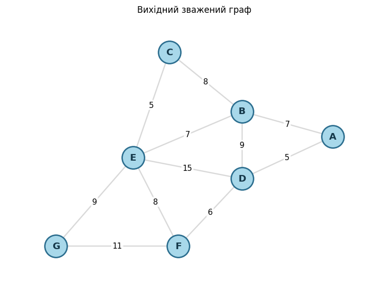

> 📦 This is an educational walkthrough of the algorithm. The **repository structure, installation and how to run** live in a separate file — [**PROJECT.md**](PROJECT.md).

---

## Contents

1. [What a minimum spanning tree is](#sec1)
2. [What a connected component is](#sec2)
3. [The idea of Kruskal's algorithm](#sec3)
4. [Building and visualizing the graph](#sec4)
5. [Implementing Kruskal via `nx.has_path`](#sec5)
6. [Step-by-step visualization of the has_path variant (forest)](#sec6)
7. [The Union-Find (DSU) data structure](#sec7)
8. [Why DSU beats `nx.has_path`](#sec8)
9. [Empirical benchmark: DSU vs `nx.has_path`](#sec9)
10. [Comparing `nx.has_path` vs DSU on a single step](#sec10)
11. [How BFS works inside `nx.has_path`](#sec11)
12. [BFS for the "add" case: target unreachable (E–G)](#sec12)
13. [Where the DSU structure at step 8 comes from](#sec13)
14. [Implementing Kruskal's algorithm](#sec14)
15. [Step-by-step DSU version: code, graph and DSU structure](#sec15)
16. [All steps in one figure (summary)](#sec16)
17. [Why the algorithm is correct](#sec17)
18. [Conclusions](#sec18)

---

The path in a nutshell: we unpack the **greedy idea** of Kruskal, implement it two ways — naively via `nx.has_path` and efficiently via **Union-Find (DSU)** — **visualize step by step** every decision (which edge is added, which is rejected as a cycle, how components merge), **prove correctness** via the cut and cycle properties, and finally analyze **complexity**, confirming it with a **benchmark**.

---

<a id="sec1"></a>

## 1. What a minimum spanning tree is

Suppose we have a weighted undirected graph $G = (V, E)$, where $V$ is the set of vertices, $E$ is the set of edges, and every edge $e$ is assigned a weight $w(e)$.

A **spanning tree** of a graph is a tree that contains **all** vertices $V$ and is a subgraph of $G$. Any tree on $n = |V|$ vertices has exactly $n-1$ edges, and between any pair of vertices there is a **unique** path (hence no cycles).

A **minimum spanning tree** is a spanning tree with the smallest total edge weight:

$$w(T) = \sum_{e \in T} w(e) \;\to\; \min$$

**Key facts:**

- An MST exists if and only if the graph is **connected**.
- If edge weights are **not unique**, there may be **several** MSTs (with the same total weight).
- An MST always has exactly $|V| - 1$ edges.

**Where it is used:** network design (minimum cable / pipe / road to connect all points), data clustering, traveling-salesman approximations, image segmentation.

### What a spanning tree is — in plain words

That tangled sentence is really made of three separate ideas. Let's unpack each.

**Picture a metaphor.** There are $n$ cities. We want to lay roads so that you can travel from any city to any other — but **without extra, duplicate roads** (no loops). The most economical such set of roads is exactly a **spanning tree**.

Now word by word from the definition:

- **"spanning"** — the tree "covers" **all** vertices: no city is left cut off.
- **"tree"** — a connected graph **with no cycles**. Like the branches of a tree: they split apart but never close into a loop.
- **"subgraph of $G$"** — we do not invent new roads; we take only edges that already exist in graph $G$.

#### Fact 1: exactly $n-1$ edges

To connect $n$ cities you need **exactly $n-1$ roads**:

- with **fewer** roads ($< n-1$) — someone is inevitably left cut off;
- with **more** roads ($> n-1$) — an extra road appears that closes a loop (a cycle).

A tree is the exact "sweet spot": everything connected, but not a single extra road.

#### Fact 2: between any pair of vertices — exactly one path

In a tree, exactly **one** route leads from one city to another. Why?

- **At least one** path always exists — because the graph is connected.
- **At most one** — because if there were **two different** routes between $u$ and $v$, then going "there" by one and "back" by the other would close a **loop (a cycle)**. But a tree has no cycles. So there is exactly one path.

That is why "unique path" and "no cycles" are **the same statement**, said two ways.

#### A concrete example

Graph **G** — 4 cities {A, B, C, D} and 5 roads: A–B, A–C, B–C, C–D, B–D. It has loops (for example, A–B–C–A), so it is **not** a tree.

One of its spanning trees: **T = {A–B, A–C, C–D}** — the same 4 vertices, but now **3 edges** (exactly n − 1) and **no cycles**. Let's look at it below.

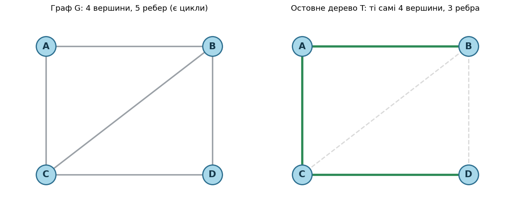

```python
import networkx as nx

# Example graph: 4 cities and the roads between them (has cycles)
G = nx.Graph()
G.add_edges_from([("A", "B"), ("A", "C"), ("B", "C"), ("C", "D"), ("B", "D")])

# One spanning tree of this graph (3 edges, no cycles)
tree_edges = [("A", "B"), ("A", "C"), ("C", "D")]
T = nx.Graph(); T.add_nodes_from(G.nodes()); T.add_edges_from(tree_edges)

# --- Verify both facts with numbers ---
n = G.number_of_nodes()
print(f"Vertices: n = {n}")
print(f"Edges in tree T: {T.number_of_edges()}  (= n - 1 = {n - 1})\n")

print("Number of simple paths A -> D:")
print("  in graph G: ", len(list(nx.all_simple_paths(G, 'A', 'D'))), "paths")
print("  in tree T:", len(list(nx.all_simple_paths(T, 'A', 'D'))), "path ->",
      list(nx.all_simple_paths(T, 'A', 'D'))[0], "\n")

print("Cycles (cycle_basis):")
print("  in graph G: ", nx.cycle_basis(G), "-> cycles exist")
print("  in tree T:", nx.cycle_basis(T), "-> no cycles")
print("\nIs T really a tree?", nx.is_tree(T))
```

```text
Vertices: n = 4
Edges in tree T: 3  (= n - 1 = 3)

Number of simple paths A -> D:
  in graph G:  4 paths
  in tree T: 1 path -> ['A', 'C', 'D']

Cycles (cycle_basis):
  in graph G:  [['C', 'B', 'D'], ['C', 'A', 'B']] -> cycles exist
  in tree T: [] -> no cycles

Is T really a tree? True
```

### Where "exactly $n-1$" comes from — and how Kruskal relates

This is clearest through **connected components** — and it is exactly the same logic that drives Kruskal's algorithm:

1. At first we have $n$ separate cities and **0 roads** — that is $n$ separate components.
2. We build a road between two **different** components → their count drops by one.
3. Each such "useful" road reduces the number of components by exactly 1.
4. To get from $n$ components down to **one** (everything connected) we need exactly $n - 1$ roads.

And if we build a road between cities that are **already in the same component**, the number of components **does not change** — instead a **cycle** appears. That is exactly the edge Kruskal skips.

So a spanning tree is precisely that set of exactly $n-1$ "useful" edges, each merging two components, with not a single "extra" one that would form a cycle.

<a id="sec2"></a>

## 2. What a connected component is

A **connected component** is a group of vertices in which you can get from any vertex to any other by moving along edges. And it is the **maximal** such group: you cannot add any vertex to it without losing this property.

**A metaphor — an archipelago of islands.** Imagine the vertices are cities and the edges are bridges. Then a connected component is an **island**: a group of cities joined by bridges.

- Inside an island you can travel from any city to any other.
- Between different islands you **cannot** travel — there are no bridges between them.

A graph may consist of **one** component (everything connected) or of **several** separate "islets".

**Connection to `has_path`:** `nx.has_path(G, u, v)` returns `True` if and only if `u` and `v` are in the **same** component (on the same island).

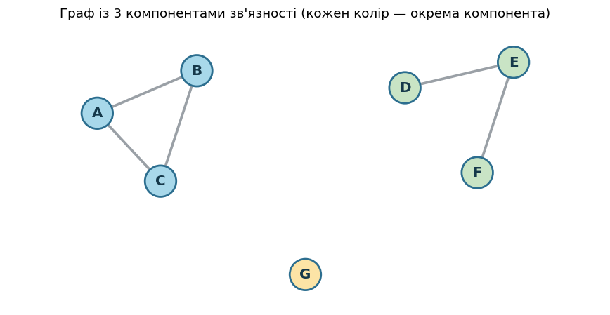

```python
import networkx as nx

# A graph made of several separate "islets"
G = nx.Graph()
G.add_edges_from([("A", "B"), ("B", "C"), ("A", "C")])   # triangle
G.add_edges_from([("D", "E"), ("E", "F")])               # chain
G.add_node("G")                                          # lone vertex

comps = list(nx.connected_components(G))
print("Number of components:", nx.number_connected_components(G))
for i, cc in enumerate(comps, 1):
    print(f"  Component {i}: {sorted(cc)}")

# has_path = True only within a single component
print("\nReachability check (has_path):")
print("  A -> C :", nx.has_path(G, "A", "C"), " (same component)")
print("  A -> D :", nx.has_path(G, "A", "D"), " (different components)")
print("  D -> G :", nx.has_path(G, "D", "G"), " (different components)")
```

```text
Number of components: 3
  Component 1: ['A', 'B', 'C']
  Component 2: ['D', 'E', 'F']
  Component 3: ['G']

Reachability check (has_path):
  A -> C : True  (same component)
  A -> D : False  (different components)
  D -> G : False  (different components)
```

### How this works in Kruskal's algorithm

Components are exactly what everything revolves around:

1. **At the start** the forest has no edges → every vertex is its own component (n separate islands of one city each).
2. Adding an edge between **different** components = building a bridge → two islands **merge** into one.
3. Adding an edge inside **one** component = a redundant bridge → it would form a **cycle** → we skip that edge.
4. **At the end** all vertices are in one component (the whole graph is connected) — and that is the spanning tree.

That is why in the step-by-step visualization **a vertex's color = its component**: you watch the islets gradually merge into one as edges are added.

<a id="sec3"></a>

## 3. The idea of Kruskal's algorithm

Kruskal is a **greedy** algorithm. The greed here is simple: *always take the cheapest edge you still can, without forming a cycle.*

**Steps:**

1. **Sort** all edges by increasing weight.
2. **Initialize the forest**: at first every vertex is a separate tree (a separate connected component). We have no tree yet, just $|V|$ isolated vertices.
3. **Go through the edges** from lightest to heaviest. For each edge $(u, v)$:
   - if $u$ and $v$ lie in **different** components → add the edge to the MST and **merge** those components into one;
   - if $u$ and $v$ are already in the **same** component → the edge would form a **cycle**, so **skip** it.
4. **Stop** once the tree has collected $|V| - 1$ edges (you don't even need to look at the rest).

**Key observation.** Everything comes down to a single question: *"are $u$ and $v$ in the same component?"*. If yes — the edge forms a cycle. We need to be able to ask this question **very fast** and **many times**.

The cycle check can be implemented via `nx.has_path(forest, u, v)` — i.e. a graph traversal runs every time. This is **correct, but slow**.

For more speed there is the **Union-Find** structure.

Below are the 2 implementation variants with explanations.

<a id="sec4"></a>

## 4. Building and visualizing the graph

Let's look at the input graph for which we will search for the MST:

```python
import networkx as nx

def build_graph():
    # Example weighted graph: 7 vertices (A–G), 11 edges.
    G = nx.Graph()
    edges = [
        ("A", "B", 7), ("A", "D", 5), ("B", "C", 8), ("B", "D", 9),
        ("B", "E", 7), ("C", "E", 5), ("D", "E", 15), ("D", "F", 6),
        ("E", "F", 8), ("E", "G", 9), ("F", "G", 11),
    ]
    for u, v, w in edges:
        G.add_edge(u, v, weight=w)
    return G

G = build_graph()
print(f"Graph built: {G.number_of_nodes()} vertices, {G.number_of_edges()} edges.")
```

```text
Graph built: 7 vertices, 11 edges.
```


<a id="sec5"></a>

## 5. How the Kruskal implementation via `nx.has_path` works

This implementation has **three moving parts**:

1. **`sorted_edges`** — all edges sorted by weight (lightest first). Kruskal always tries to take the cheapest edge first.
2. **`forest`** — a helper graph that tracks the **connected components**. At first it is just all the vertices with no edges (each vertex is a separate component). Every time we add an edge to the MST, we add it **to `forest` as well**, so `forest` always "remembers" what is already connected to what.
3. **`nx.has_path(forest, u, v)`** — asks: "does a path between `u` and `v` already exist?". This is exactly the cycle check.

**The core idea of the cycle check.** A new edge `u–v` forms a cycle **if and only if** `u` and `v` are **already connected** (a path between them already exists). Therefore:

- `has_path` returns **False** → no path yet → the vertices are in **different** components → the edge is safe → we **add** it;
- `has_path` returns **True** → a path already exists → the vertices are in the **same** component → the edge would close a cycle → we **skip** it.

This is exactly the same "components" logic as in the definition of a spanning tree: `forest` is the bookkeeping, and `has_path` is a query into it.

```python
import networkx as nx

def kruskal_mst(graph):
    # === STEP 1: a forest of vertices only (no edges yet) ===
    # forest tracks the connected components. At first each vertex is
    # a separate component (a separate "tree" of the forest).
    forest = nx.Graph()
    for node in graph.nodes():
        forest.add_node(node)              # add all vertices, no edges yet

    # === STEP 2: sort edges by weight (lightest first) ===
    # graph.edges(data=True) yields tuples of the form (u, v, {'weight': w}).
    # key=lambda t: t[2].get('weight', 1) takes the weight from the third element
    # (from the attribute dict); if there happens to be no weight, treats it as 1.
    sorted_edges = sorted(graph.edges(data=True),
                          key=lambda t: t[2].get('weight', 1))

    mst = nx.Graph()                       # the future minimum spanning tree

    # === STEP 3: go through edges from lightest to heaviest ===
    for edge in sorted_edges:
        u, v, attr = edge
        # has_path == False  =>  no path yet between u and v  =>  they are in
        # DIFFERENT components  =>  the edge will NOT create a cycle  =>  take it
        if not nx.has_path(forest, u, v):
            forest.add_edge(u, v)                       # connect the components in the forest
            mst.add_edge(u, v, weight=attr['weight'])   # get the number by the 'weight' key
        # otherwise (a path exists) u and v are in the SAME component => the edge would form a cycle => skip

    return mst
```

The direct output of this code on our graph (MST edges in the order they were added):

```text
Edges in the MST:
('A', 'D', {'weight': 5})
('A', 'B', {'weight': 7})
('D', 'F', {'weight': 6})
('C', 'E', {'weight': 5})
('E', 'B', {'weight': 7})
('E', 'G', {'weight': 9})
```

### Two subtleties of this code

**Subtlety 1: why `attr['weight']` and not just `weight`?**

`graph.edges(data=True)` returns each edge as a **three**-element tuple: `(u, v, attr)`, where `attr` is the **attribute dictionary**. For example, for edge A–B, unpacking `u, v, attr = edge` gives:

- `u = 'A'`
- `v = 'B'`
- `attr = {'weight': 7}`  ← this is a **dictionary**!

That is exactly why, to get the number `7`, the code writes `attr['weight']` (accessing the dictionary by the key `'weight'`).

**Subtlety 2: why does `if not nx.has_path(...)` mean "no cycle"?**

`forest` accumulates exactly the edges that already made it into the MST. So the question "is there a path between `u` and `v` in `forest`?" = "are they already in the same component?".

- no path (`has_path == False`) → different components → the edge **connects two separate parts**, no cycle → add it;
- a path exists (`has_path == True`) → one component → the edge **would close a loop** → skip it.

So `not has_path` is exactly the condition "adding the edge will not create a cycle".

Running this code on our graph yields an MST of weight **39**. The same decision is conveniently summarized in a table (edges by increasing weight, decisions made top to bottom):

| # | Edge | Weight | Decision | Why |
|--:|:----:|:------:|:---------|:----|
| 1 | A–D | 5 | ✅ added | merges {A} and {D} |
| 2 | C–E | 5 | ✅ added | merges {C} and {E} |
| 3 | D–F | 6 | ✅ added | merges {A, D} and {F} |
| 4 | A–B | 7 | ✅ added | merges {A, D, F} and {B} |
| 5 | B–E | 7 | ✅ added | merges {A, B, D, F} and {C, E} |
| 6 | B–C | 8 | ❌ cycle | B and C are already in one component |
| 7 | E–F | 8 | ❌ cycle | E and F are already in one component |
| 8 | B–D | 9 | ❌ cycle | B and D are already in one component |
| 9 | E–G | 9 | ✅ added | attaches {G} — **tree complete (6 edges)** |
| 10 | F–G | 11 | — | not considered (already collected $\|V\|-1=6$ edges) |
| 11 | D–E | 15 | — | not considered |

**Total weight:** $5 + 5 + 6 + 7 + 7 + 9 = \mathbf{39}$.

<a id="sec6"></a>

## 6. Step-by-step visualization of the has_path variant (forest)

The algorithm is shown **one panel per algorithm step**. On each panel:

- **on the left** — the algorithm's code, with the lines that **fire on this very step** highlighted;
- **on the right** — the graph, showing **what that code fragment does** to the state.

**Code highlighting:**
- 🟡 yellow — the line executing right now;
- 🟢 green — the "add edge" branch fired;
- 🔴 red — the "skip (cycle)" branch fired.

**Graph:**
- a vertex's color = its **connected component** (different colors — different components);
- gray edges — not used yet; green — already in the MST;
- 🟧 orange — the edge we just **added**; 🔴 red dashed — the edge we **rejected** (cycle).

There are 13 panels in total: forest initialization, edge sorting, and then one per each of the 11 edges. Note: this variant checks **all** edges — even `F–G` and `D–E` after the tree is already complete at step 11 (they are simply rejected as cycles).

All 13 panels together (a row = `[ code | graph ]`; the active lines are highlighted on the left, the graph state on the right):

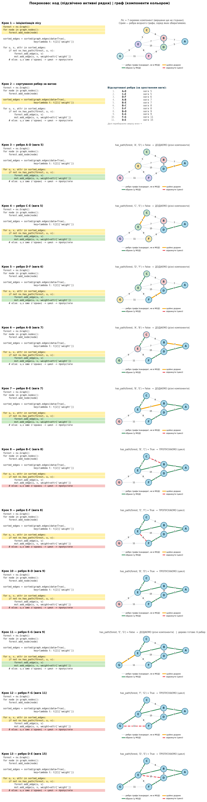

### Why edge B–C is skipped at step 8

**Kruskal's rule:** we skip an edge if its endpoints are **already in the same component** — because then it would only close a cycle, and a tree cannot contain cycles.

At step 8 we check B–C, and `has_path(forest, 'B', 'C') = True`. How come B and C are already connected? Let's see what was added on the previous steps:

- **step 4:** added `C–E` → C and E ended up in the same component;
- **step 7:** added `B–E` → B joined that same component through E.

So B and C are **already connected through E**: there is a path **B → E → C** along the already-added (green) edges. Before step 8 the whole component is `{A, B, C, D, E, F}`, and both B and C are in it.

If we now added the direct edge B–C, it would close the triangle — **the cycle B → E → C → B**. That is why `has_path` returns `True` and the edge is rejected.

In plain words: B and C are already on the same "island", connected through E. A direct bridge B–C connects nothing new — it would only create a redundant loop.

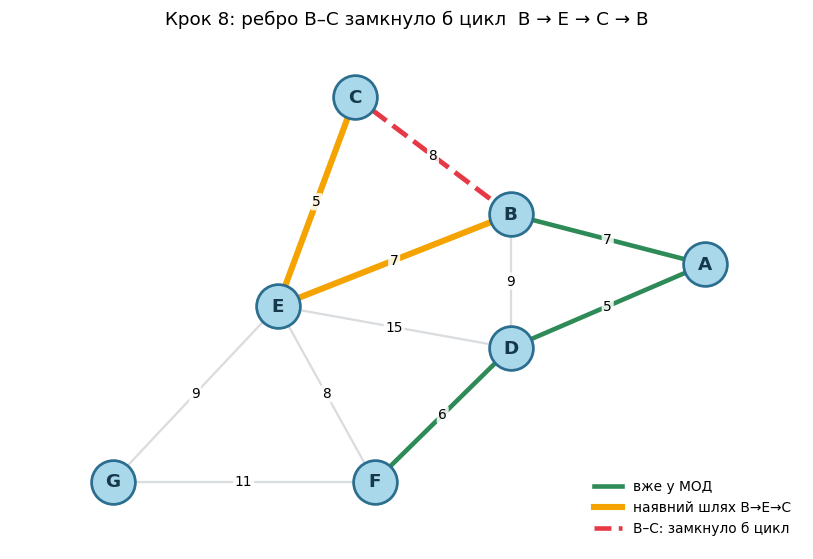

### Summary

The result is correct: an MST of weight **39** with edges A–D, A–B, D–F, C–E, E–B, E–G. The algorithm works correctly because it always takes the lightest edge that does not form a cycle — and that is exactly the greedy path to a minimum-weight spanning tree.

The only weakness is **speed**. `nx.has_path(forest, u, v)` runs a graph traversal every time to answer "in the same component?". This is correct but slow: each of the $E$ edges costs up to $O(V + E)$.

The same question is asked by `DSU.find(u) == DSU.find(v)` — and answered **almost instantly** (amortized $\approx O(1)$). The logic is identical — only the structure that tracks components changes. So the DSU version gives the **same result** but scales incomparably better.

<a id="sec7"></a>

## 7. The Union-Find data structure (Disjoint Set Union, DSU)

**Union-Find**, also known as **DSU** (*Disjoint Set Union*), is a data structure that stores a partition of elements into **disjoint sets** (each element belongs to exactly one set) and can do two things quickly:

- **`find(x)`** — returns the "representative" (root) of the set that `x` belongs to. Two elements are in the same set **if and only if** they have the same representative.
- **`union(a, b)`** — merges the two sets containing `a` and `b` into one.

From this follows the main query: "are `a` and `b` in the same set?" — it is simply `find(a) == find(b)`.

### Why it fits Kruskal perfectly

In Kruskal the sets are the **connected components**:

| Kruskal concept | DSU operation |
|:--|:--|
| "are `u` and `v` already in the same component?" (will there be a cycle) | `find(u) == find(v)` |
| add an edge, connecting two components | `union(u, v)` |
| at the start each vertex is its own component | `DSU(vertices)` |

So the whole "bookkeeping" side of Kruskal is exactly two DSU operations.

### How DSU works inside: a forest of parent pointers

DSU stores each set as a **tree of pointers**: each element remembers its **parent** (`parent`). An element that is its own parent is the **root** (the set's representative).

- **`find(x)`** = climb the `parent` pointers up to the root.
- **`union(a, b)`** = find the roots of both sets and **hang one root under the other**.
- **At the start** each element is its own root: we have $n$ separate single-node trees.

Important: these are **not** the edges of the original graph, but DSU's internal bookkeeping structure — it only answers the question "who is in the same set as whom".

### Two optimizations that make DSU almost instant

If you do `union` naively (hanging trees any which way), a tree can **grow into a long chain**, and then `find` has to traverse $O(n)$ steps — slow. Two optimizations prevent this:

1. **Union by rank** — hang the smaller/shorter tree under the bigger one. This keeps trees shallow.
2. **Path compression** — during `find`, re-hang all the visited nodes directly to the root. The tree "flattens".

Together they give an amortized $O(\alpha(n))$ per operation, where $\alpha$ is the inverse Ackermann function. For any realistic $n$ we have $\alpha(n) \le 4$, i.e. effectively a **constant**. Here is what it looks like.

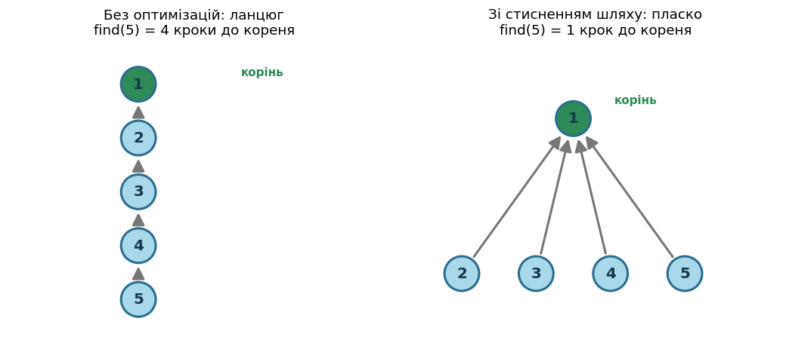

```python
class DSU:
    # Disjoint Set Union with union by rank and path compression.

    def __init__(self, vertices):
        self.parent = {v: v for v in vertices}   # each is its own root
        self.rank   = {v: 0 for v in vertices}   # an approximate tree "height"

    def find(self, x):
        # 1) climb to the root
        root = x
        while self.parent[root] != root:
            root = self.parent[root]
        # 2) path compression: hang everyone on the path directly to the root
        while self.parent[x] != root:
            self.parent[x], x = root, self.parent[x]
        return root

    def union(self, a, b):
        ra, rb = self.find(a), self.find(b)
        if ra == rb:
            return False                          # already in one set — do nothing
        # hang the smaller rank under the bigger one
        if self.rank[ra] < self.rank[rb]:
            ra, rb = rb, ra
        self.parent[rb] = ra
        if self.rank[ra] == self.rank[rb]:
            self.rank[ra] += 1
        return True                               # the sets really merged
```

A small sanity check:

```python
d = DSU(["A", "B", "C", "D"])
print("A and B together at first?", d.find("A") == d.find("B"))   # False
d.union("A", "B")
print("After union(A, B) together? ", d.find("A") == d.find("B"))  # True
print("A and C together?           ", d.find("A") == d.find("C"))   # False
```

```text
A and B together at first? False
After union(A, B) together?  True
A and C together?            False
```

### Animation: how DSU is built from the inside

This animation on 5 elements shows the **internal structure** of DSU step by step: first a few `union`s (with **union by rank**), then `find(D)` with **path compression**.

What the notation means:
- an **arrow** points from a node to its **parent** (`parent`);
- a **gold border** = a root (a node pointing to itself); the root's **rank** is written next to it;
- **orange** = the node we are at right now during `find`; **green** = the found root.

What to watch:
- **Steps 2–5 (union):** when two roots have **equal** ranks — one is hung under the other, and the new root's rank grows by 1; when **different** — the smaller under the bigger (the rank does not grow). After `union(A, C)` node **D ends up at depth 2**: D → C → A.
- **Steps 6–9 (find):** we climb from D along the arrows to the root (D → C → A), and then **path compression** re-hangs D **directly to root A** — now D reaches the root in 1 hop. This is exactly what keeps trees flat and `find` fast.

> 🎞️ Below — **one and the same animation in two formats** (not two different explanations): a GIF that plays on its own, and the same video with controls. Pick whichever is handier.

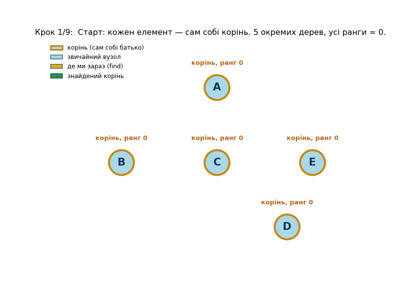

▶️ *The same video — with play / pause / seek buttons:*

https://github.com/user-attachments/assets/ac0897b4-e85e-4c5b-b60d-031326df973d

<a id="sec8"></a>

## 8. Why DSU beats `nx.has_path` in Kruskal

Both approaches answer the same question — "are `u` and `v` already connected?" — but their mechanism is fundamentally different.

**`nx.has_path(forest, u, v)`** runs a **graph traversal** (BFS/DFS) from `u` until it finds `v` or walks the whole forest:

- one call costs $O(V + E)$;
- the call **remembers nothing** — next time the traversal starts from scratch.

**DSU**, on the other hand, **keeps the component structure and updates it incrementally**:

- `find(u)` / `find(v)` and `union` cost $\approx O(\alpha(V)) \approx O(1)$ — almost instant;
- the state is preserved between calls, nothing is recomputed.

**The essence of the difference:** `has_path` **recomputes** connectivity from scratch every time, walking the whole forest; DSU **keeps** it in memory and answers almost instantly. The bigger the graph, the slower `has_path` (more to traverse), while DSU stays fast. So the gap **grows** with the graph size.

### Complexity of the whole Kruskal

Let $V = |V|$, $E = |E|$. Any version of the algorithm = **sort the edges** + **$E$ "cycle / no cycle" checks**. The whole difference is in the cost of a single check:

| Cycle check | Sorting | $E$ checks | Total |
|:--|:--|:--|:--|
| `nx.has_path` | $O(E \log E)$ | $O(E \cdot (V + E))$ | $O(E \cdot (V + E))$ — the checks dominate |
| **DSU** | $O(E \log E)$ | $O(E \cdot \alpha(V)) \approx O(E)$ | $O(E \log E)$ — the sorting dominates |

In the DSU version the checks become almost free ($\approx O(E)$), so the time is determined only by sorting the edges — which is **optimal** for an algorithm that must look at all edges. (Since in a simple graph $E < V^2$, we have $\log E < 2\log V$, so equivalently people write $O(E \log E) = O(E \log V)$.)

**Memory:** $O(V + E)$.

`nx.has_path` is a one-liner, with no extra structures, great for tiny graphs and for grasping the idea. But at real sizes the right tool is DSU. Let's check the difference with numbers.

<a id="sec9"></a>

## 9. Empirical benchmark: DSU vs `nx.has_path`

Let's compare the two implementations on random connected graphs of growing size. First we make sure **both give the same MST weight**, then we measure the time.

```python
import time, random
import networkx as nx

def kruskal_dsu(G):
    # Fast implementation (via Union-Find). Returns the MST weight.
    dsu = DSU(G.nodes())
    total, cnt, need = 0, 0, G.number_of_nodes() - 1
    for u, v, w in sorted(G.edges(data="weight"), key=lambda e: e[2]):
        if dsu.union(u, v):
            total += w; cnt += 1
            if cnt == need:
                break
    return total

def kruskal_naive(G):
    # The has_path variant: cycle check via nx.has_path. Returns the MST weight.
    forest = nx.Graph()
    forest.add_nodes_from(G.nodes())
    total = 0
    for u, v, w in sorted(G.edges(data="weight"), key=lambda e: e[2]):
        if not nx.has_path(forest, u, v):     # no path => the edge won't form a cycle
            forest.add_edge(u, v)
            total += w
    return total

def random_connected(n, seed):
    # A random connected weighted graph: a spanning tree + ~n extra edges.
    rng = random.Random(seed)
    G = nx.random_labeled_tree(n, seed=seed)   # a tree => guaranteed connectivity
    nodes = list(G.nodes())
    added = 0
    while added < n:
        u, v = rng.sample(nodes, 2)
        if not G.has_edge(u, v):
            G.add_edge(u, v); added += 1
    for u, v in G.edges():
        G[u][v]["weight"] = rng.randint(1, 100)
    return G
```

```python
# 1) Correctness check: both implementations give the same MST weight
for s in range(5):
    g = random_connected(40, s)
    assert kruskal_dsu(g) == kruskal_naive(g)
print("Correctness: on 5 random graphs both implementations gave the same MST weight ✔")

# 2) Timing table
print(f"{'nodes':>7} | {'edges':>6} | {'DSU, ms':>9} | {'naive, ms':>10} | {'speedup':>12}")
print("-" * 56)
for n in [50, 100, 200, 400, 600]:
    g = random_connected(n, 123)
    t0 = time.perf_counter(); kruskal_dsu(g);   td = (time.perf_counter() - t0) * 1000
    t0 = time.perf_counter(); kruskal_naive(g); tn = (time.perf_counter() - t0) * 1000
    print(f"{n:>7} | {g.number_of_edges():>6} | {td:>9.3f} | {tn:>10.3f} | {tn/td:>10.1f}×")
```

One example run (the absolute numbers depend on the machine — focus on the speedup trend):

```text
Correctness: on 5 random graphs both implementations gave the same MST weight ✔

  nodes |  edges |   DSU, ms |  naive, ms |      speedup
--------------------------------------------------------
     50 |     99 |     2.418 |      2.198 |        0.9×
    100 |    199 |     0.627 |      6.992 |       11.2×
    200 |    399 |     3.314 |     23.474 |        7.1×
    400 |    799 |     2.780 |    279.080 |      100.4×
    600 |   1199 |    13.008 |    223.287 |       17.2×
```

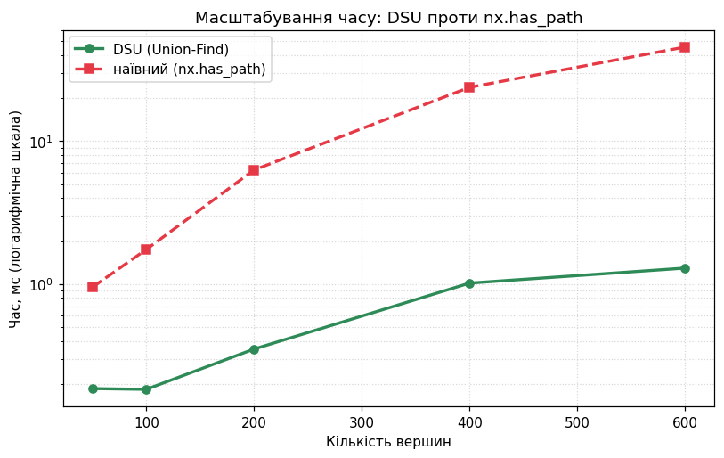

On tiny graphs there is almost no difference (because of DSU's overhead it can even be a touch slower). On bigger graphs DSU wins dramatically, and the gap grows — exactly as the asymptotics $O(E \log E)$ vs $O(E \cdot (V + E))$ predict.

<a id="sec10"></a>

## 10. Comparing `nx.has_path` vs DSU on a single step

Let's take the **same question** — "are B and C already connected?" — at step 8 (edge B–C) and do it **both ways side by side**. By then the forest already has edges A–D, C–E, D–F, A–B, B–E, so B and C are in fact in the same component.

- **On the left — `nx.has_path`:** it **walks the graph** (BFS), hopping from vertex to vertex along edges until it bumps into C. It works with the **forest-graph** (real edges between vertices).
- **On the right — DSU:** it simply **looks at the "group label" (root)** of vertex B and vertex C, climbing the `parent` pointers (1–2 hops), and compares them. It works with a **flat tree of pointers** (each vertex points to its representative).

So it is not just a difference in speed — these are **different structures** and **different kinds of work**: "walk the graph" vs "compare two labels".

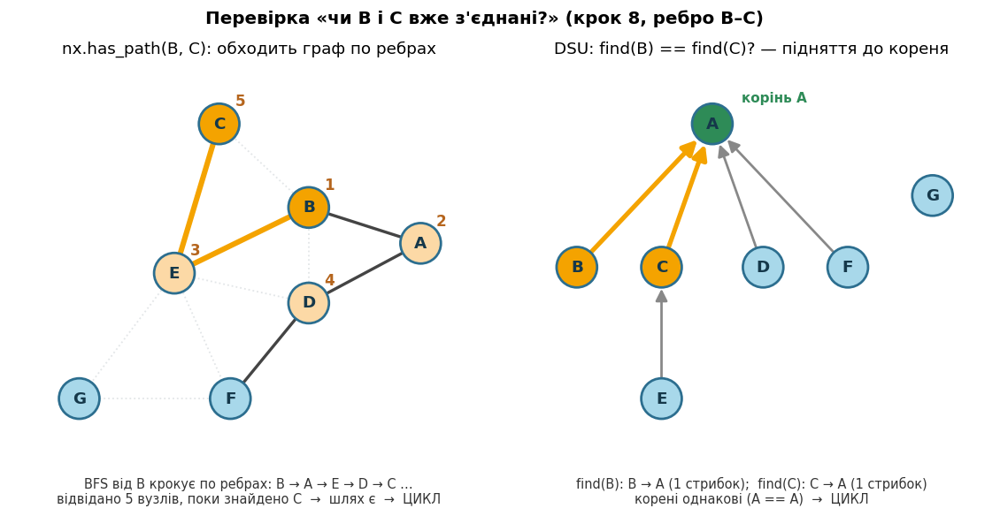

<a id="sec11"></a>

## 11. How BFS works inside `nx.has_path`

**BFS** (Breadth-First Search) is a way to traverse a graph in "waves" from a start vertex. Here it answers the question: *"can we reach C from B along edges?"*

The main tool is a **queue** (FIFO principle: first in, first processed):

1. Put the start vertex (**B**) into the queue and mark it visited.
2. Take the vertex from the **front** of the queue — this is the current vertex we are "processing".
3. Look at its **neighbors** — the vertices joined to it by an **edge**. Mark each not-yet-visited neighbor as visited and put it at the **back** of the queue.
4. If the target (**C**) turns up among the neighbors — stop, the path is found.
5. Otherwise return to step 2 — until the queue is empty.

**Why "hops along edges"?** BFS can move from a vertex **only to its neighbor** — i.e. where a **direct edge** leads. Without an edge there is no move. So the search "crawls" through the graph strictly along the existing edges, vertex by vertex.

**Why "forest-graph"?** `has_path` is called on `forest` — a graph that has **only the edges already added to the MST**. So BFS wanders exactly along those real edges. In the animation: solid gray — forest edges (you can walk along them), and the faint dotted ones — edges of the original graph that are **not yet** in the forest (you cannot walk along them).

**Two possible search outcomes:**

- we reach **C** → a path exists → B and C are in one component → edge B–C would form a **cycle**;
- the queue empties but C was never found → no path → different components → the edge **can be added**.

> 🎞️ Below — **one and the same animation in two formats** (not two different explanations): a GIF that plays on its own, and the same video with controls. Pick whichever is handier.

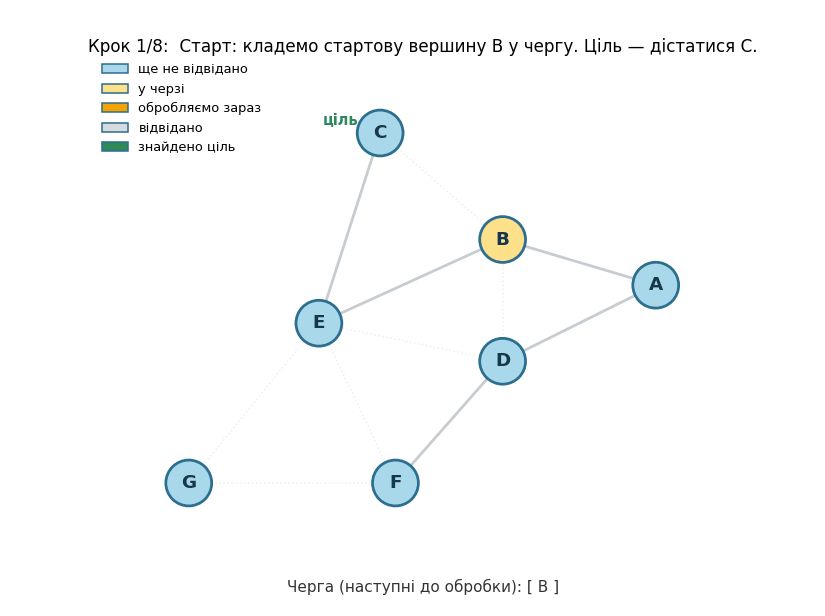

▶️ *The same video — with play / pause / seek buttons:*

https://github.com/user-attachments/assets/d7326e5c-f650-4d40-ad8b-a5baa1f0aa99

<a id="sec12"></a>

## 12. BFS for the "add" case: target unreachable (Step 11, E–G)

Now the opposite case: we check edge **E–G**, but **G is in a separate component** (there is not a single edge to it in the forest yet). BFS starts from E and looks for G.

The most important thing here: since there is **no** path, BFS **cannot stop early** — it has to walk the **whole** component {A, B, C, D, E, F} before being sure that G is unreachable. So the "add" case is the **worst** one for `has_path`: maximum work.

When the queue finally empties and G has still not been found → no path → E and G are in **different** components → edge E–G is **safe to add** (no cycle).

> For comparison: DSU would answer this in 2 hops — `find(E) ≠ find(G)` — without walking anything at all. This is exactly where the speed difference is most noticeable.

> 🎞️ Below — **one and the same animation in two formats** (not two different explanations): a GIF that plays on its own, and the same video with controls. Pick whichever is handier.

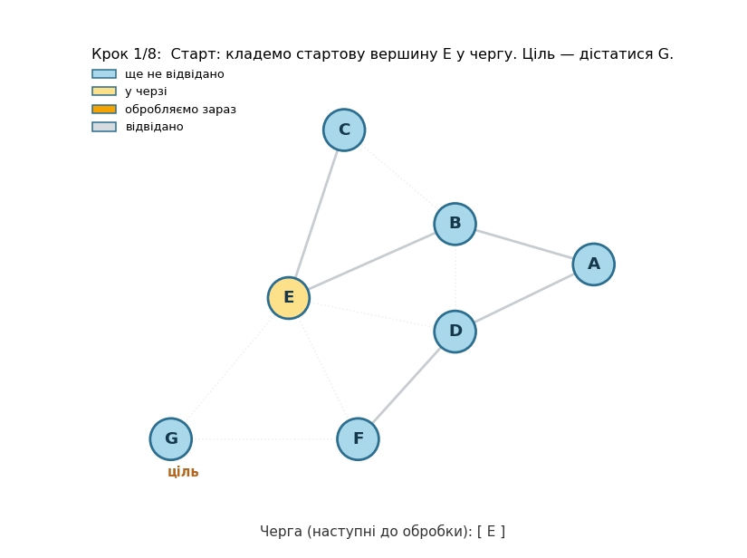

▶️ *The same video — with play / pause / seek buttons:*

https://github.com/user-attachments/assets/378874d0-b067-489c-8815-c46e4a495e22

<a id="sec13"></a>

## 13. Where this DSU structure at step 8 comes from (animation)

The structure on the right panel (A is the root; B, C, D, F → A; E → C; G separate) is no accident — it was **built from the 5 edges that were added to the MST** before step 8: A–D, C–E, D–F, A–B, B–E. The animation below shows this process step by step, and then the B–C check itself.

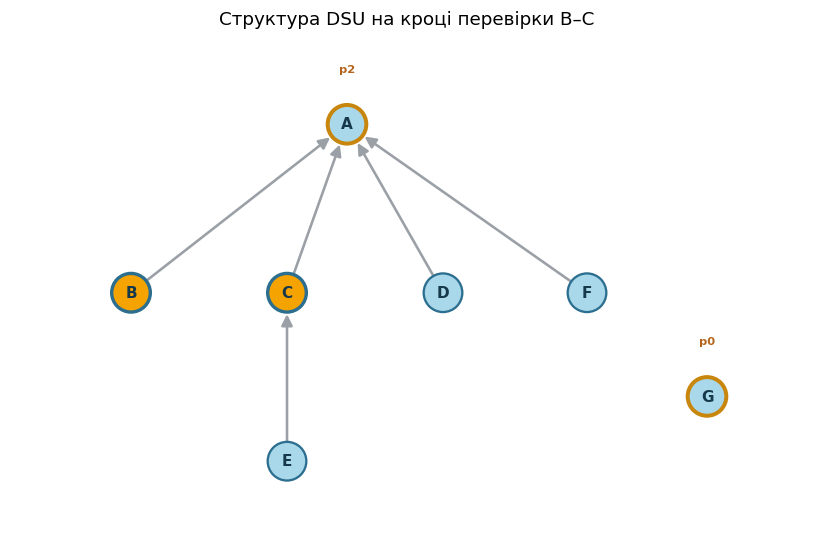

> 🎞️ Below — **one and the same animation in two formats** (not two different explanations): a GIF that plays on its own, and the same video with controls. Pick whichever is handier.

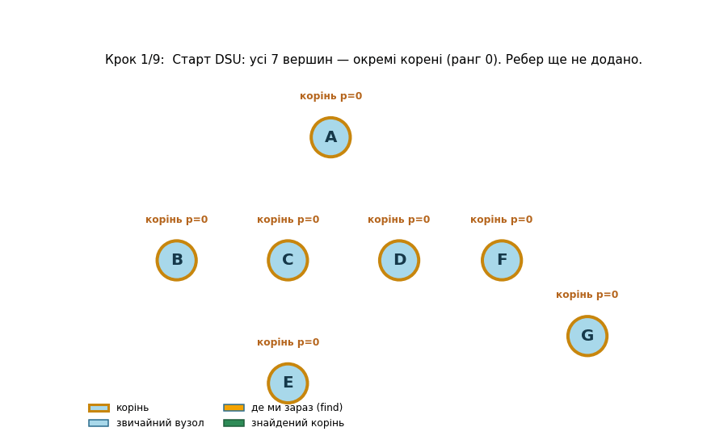

▶️ *The same video — with play / pause / seek buttons:*

https://github.com/user-attachments/assets/1928f991-48b9-4646-b1a4-b464e6f8a966

What to watch:

- **Steps 2–6 (union):** each added MST edge triggers a `union` of two roots. Thanks to **rank**, the smaller tree goes under the bigger one, so the structure stays flat. Note that after `union(B, E)` vertex **E ends up at depth 2** (E → C → A) — exactly as on the screenshot.
- **Steps 7–9 (the B–C check):** `find(B)` climbs B → A in **1 hop**, `find(C)` — C → A also in **1 hop**. The roots are equal (A == A) → B and C are already in one set → edge B–C would form a **cycle**, so we skip it.

That is exactly why in the earlier comparison DSU finished in 2 hops while `has_path` had to walk half the graph.

### So what is the fundamental difference

| | `nx.has_path` | DSU (`find`) |
|:--|:--|:--|
| What it does | **walks the graph** (BFS/DFS) from vertex to vertex | **compares two labels** (roots) |
| Structure | forest-graph: real edges between vertices | flat tree of pointers to the representative |
| Work per 1 check | $O(V + E)$ — and **from scratch every time** | $\approx O(1)$ — 1–2 hops to the root |
| Worst case | when there is **no** path — walks the **whole** component | the same — 1–2 hops |

**A metaphor.** To check whether two districts of a city are connected by roads:

- `has_path` **walks on foot every time** across the whole city, looking for a route;
- DSU just looks at each district's **"postal code" (root)** and compares.

On this small graph the difference is modest (5 nodes vs 2 hops). But the cost of `has_path` **grows with the graph size** and **repeats for every edge**, whereas DSU stays almost constant. That is exactly why in the benchmark the gap grew from ~8× to ~39× as the graph grew.

### Summary (DSU vs `has_path`)

- **DSU (Union-Find)** keeps elements in disjoint groups and provides two operations: `find` (who is the group's representative) and `union` (merge groups). The query "in the same group?" is `find(a) == find(b)`.
- Internally it is a **forest of parent pointers**: `find` climbs to the root, `union` hangs one root under another.
- **Union by rank** + **path compression** keep the trees flat, so each operation costs practically a **constant** ($O(\alpha(n))$).
- In Kruskal, DSU replaces the cycle check: `find(u) == find(v)` instead of a graph traversal.
- That is why Kruskal on DSU runs in $O(E \log E)$ (the sorting dominates), while the `nx.has_path` variant runs in $O(E \cdot (V+E))$, because it re-walks the forest every time. The empirics confirm it: the speed gap grows with the graph size.

<a id="sec14"></a>

## 14. Implementing Kruskal's algorithm

Now the algorithm itself. It is short precisely thanks to DSU: all the "will there be a cycle" logic hides in a single `union` call, which returns `False` if the vertices were already in the same component.

```python
class DSU:
    # Disjoint Set Union with union by rank and path compression.
    def __init__(self, vertices):
        self.parent = {v: v for v in vertices}   # each is its own root
        self.rank   = {v: 0 for v in vertices}   # an approximate tree "height"

    def find(self, x):
        root = x
        while self.parent[root] != root:         # 1) climb to the root
            root = self.parent[root]
        while self.parent[x] != root:             # 2) path compression
            self.parent[x], x = root, self.parent[x]
        return root

    def union(self, a, b):
        ra, rb = self.find(a), self.find(b)
        if ra == rb:
            return False                          # already in one group
        if self.rank[ra] < self.rank[rb]:         # smaller rank — under the bigger
            ra, rb = rb, ra
        self.parent[rb] = ra
        if self.rank[ra] == self.rank[rb]:
            self.rank[ra] += 1
        return True


# Demonstration
dsu = DSU(["A", "B", "C", "D", "E"])
print("A and B together?", dsu.find("A") == dsu.find("B"))   # False

dsu.union("A", "B"); dsu.union("C", "D")
print("\nafter union(A,B), union(C,D):")
print("  A and B together?", dsu.find("A") == dsu.find("B"))  # True
print("  A and C together?", dsu.find("A") == dsu.find("C"))  # False

dsu.union("B", "C")                                       # merges {A,B} and {C,D}
print("\nafter union(B,C):")
print("  A and D together?", dsu.find("A") == dsu.find("D"))  # True
print("  internal parent:", dsu.parent)
```

```text
A and B together? False

after union(A,B), union(C,D):
  A and B together? True
  A and C together? False

after union(B,C):
  A and D together? True
  internal parent: {'A': 'A', 'B': 'A', 'C': 'A', 'D': 'A', 'E': 'E'}
```

```python
def kruskal_mst(G):
    # Returns (list of MST edges, total weight).
    dsu = DSU(G.nodes())
    mst_edges, total = [], 0
    need = G.number_of_nodes() - 1

    # 1) all edges by increasing weight
    for u, v, w in sorted(G.edges(data="weight"), key=lambda e: e[2]):
        # 2) union returns True only if the edge joined different components
        if dsu.union(u, v):
            mst_edges.append((u, v, w))
            total += w
            if len(mst_edges) == need:   # tree complete — no point looking further
                break
    return mst_edges, total

mst, total = kruskal_mst(G)
for u, v, w in mst:
    print(f"  {u} — {v}   (weight {w})")
print(f"\nNumber of edges: {len(mst)}  (expected |V|-1 = {G.number_of_nodes() - 1})")
print(f"Total MST weight: {total}")     # 39
```

```text
Edges of the minimum spanning tree:
  A — D   (weight 5)
  C — E   (weight 5)
  D — F   (weight 6)
  A — B   (weight 7)
  B — E   (weight 7)
  E — G   (weight 9)

Number of edges: 6  (expected |V|-1 = 6)
Total MST weight: 39
```

<a id="sec15"></a>

## 15. Step-by-step DSU version: "code | graph | DSU structure"

The same format as for `nx.has_path`, but each step shows **three** panels side by side: `[ code | graph | DSU structure ]`. Two differences from the `has_path` version:
- on the left the **DSU code** is shown (`dsu.union(u, v)` instead of `nx.has_path`);
- the cycle check is read from the result of `union`: it returns **True** if the vertices were in **different** sets (we take the edge), and **False** if already in the **same** one (a cycle — we skip it).

**The middle panel — the graph** (as in our grid): a vertex's color = component, green — in the MST, orange — just added, red dashed — rejected (cycle).

**The right panel — the DSU structure**: the same forest of parent pointers (arrow → parent, gold border = a root with its rank). On it you can see:
- on an **add** — how one root is hung under another (orange arrow), and how the rank grows;
- on a **cycle** — that both endpoints of the edge (orange) lead to the **same** root, so we reject the edge.

So the connection is immediately visible: what on the graph is "a single-color component" is in DSU "a tree with one root". Below — **all the steps** (initialization, sorting, and one per each edge) plus the **summary**, each in the `[ code | graph | DSU structure ]` format with a legend on every step:

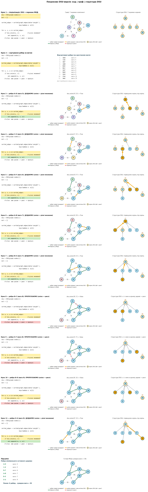

### Decision table

The same process as a table. Edges are sorted by increasing weight; decisions are made top to bottom.

| # | Edge | Weight | Decision | Why |
|--:|:----:|:------:|:---------|:----|
| 1 | A–D | 5 | ✅ added | merges {A} and {D} |
| 2 | C–E | 5 | ✅ added | merges {C} and {E} |
| 3 | D–F | 6 | ✅ added | merges {A, D} and {F} |
| 4 | A–B | 7 | ✅ added | merges {A, D, F} and {B} |
| 5 | B–E | 7 | ✅ added | merges {A, B, D, F} and {C, E} |
| 6 | B–C | 8 | ❌ cycle | B and C are already in one component |
| 7 | E–F | 8 | ❌ cycle | E and F are already in one component |
| 8 | B–D | 9 | ❌ cycle | B and D are already in one component |
| 9 | E–G | 9 | ✅ added | attaches {G} — **tree complete (6 edges)** |
| 10 | F–G | 11 | — | not considered (already collected $\|V\|-1=6$ edges) |
| 11 | D–E | 15 | — | not considered |

**Total weight:** $5 + 5 + 6 + 7 + 7 + 9 = \mathbf{39}$.

The final minimum spanning tree:

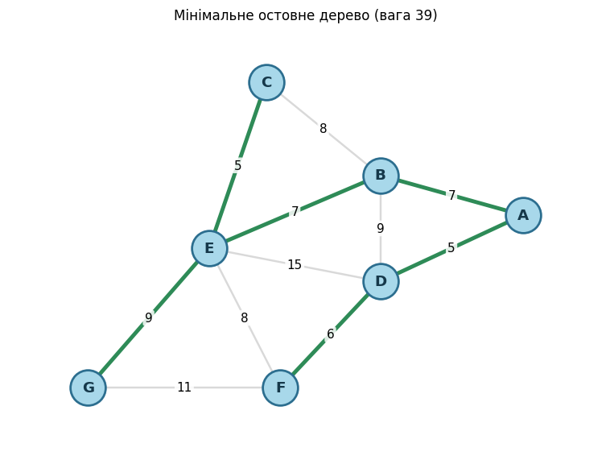

<a id="sec16"></a>

## 16. All steps in one figure (summary)

A compact overview: edges are scanned by increasing weight; green — in the MST, orange — just added, red dashed — rejected (cycle). The detailed step-by-step breakdown with code and DSU structure is above, in §15.

```python
def kruskal_logged(G):
    # Like kruskal_mst, but also returns a step-by-step log for visualization.
    nodes = list(G.nodes())
    dsu = DSU(nodes)
    mst_edges, total, steps = [], 0, []
    need = len(nodes) - 1

    for u, v, w in sorted(G.edges(data="weight"), key=lambda e: e[2]):
        if len(mst_edges) == need:
            decision = "stop"                      # tree already complete
            accepted = False
        else:
            accepted = dsu.union(u, v)
            decision = "merge" if accepted else "cycle"
            if accepted:
                mst_edges.append((u, v, w))
                total += w
        steps.append({
            "edge": (u, v, w),
            "accepted": accepted,
            "reason": decision,                    # "merge" / "cycle" / "stop"
            "mst_after": list(mst_edges),          # MST edges after this step
            "comp_after": {n: dsu.find(n) for n in nodes},   # vertex -> component root
        })
    return mst_edges, total, steps
```

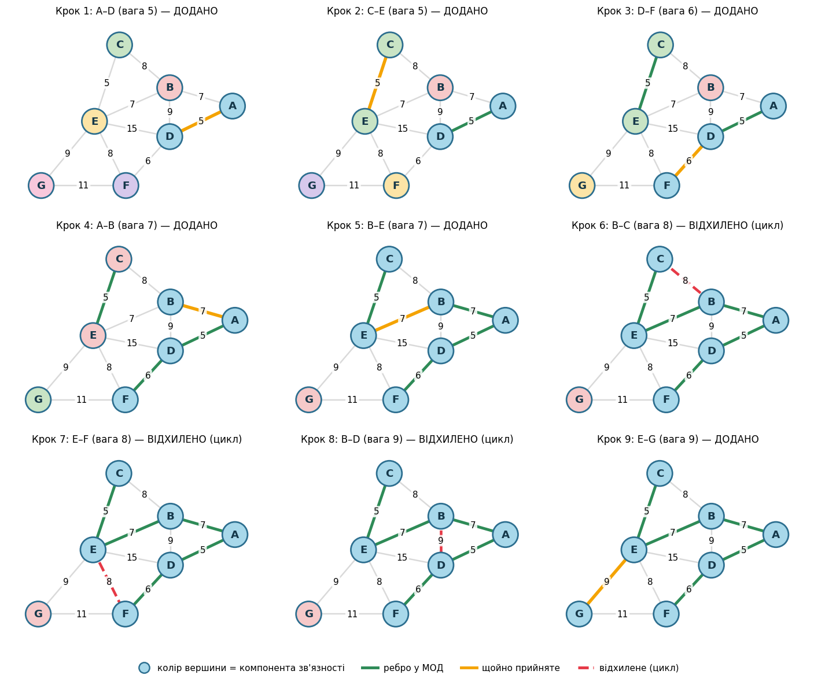

<a id="sec17"></a>

## 17. Why the algorithm is correct

Kruskal's greedy choice is not "by eye" but **provably** correct. Two simple ideas are enough.

### What a cut is

Split all vertices into **two groups** (any way, as long as each is non-empty). An edge **crosses the cut** if one of its endpoints is in one group and the other is in the other (see the figure below).

**The cut rule:** among all edges that cross the cut, the **lightest** one necessarily belongs to some minimum spanning tree. So it is always **safe to take**.

How this works in Kruskal: when we add an edge (u, v), the vertices u and v are still in different components. Look at the cut "the component of vertex u" vs "all other vertices". We scan edges from the lightest, so all the lighter ones have already been considered — and none connected these two sides. Hence (u, v) is the lightest edge across this cut, and it is safe to take.

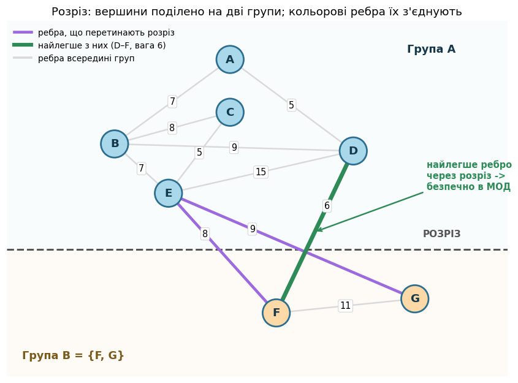

### The cycle rule

**The cycle rule:** if you take the **heaviest** edge of some cycle, it is definitely **not** in any minimum spanning tree.

When Kruskal skips an edge (because it would form a cycle), that cycle consists of already-added, lighter edges. So the skipped edge is the heaviest in the cycle, and dropping it is safe.

### Why the resulting tree is optimal (the idea)

Imagine that the tree T built by Kruskal differs from some best tree T\*. Take the first edge e that Kruskal added but that is not in T\*. If we add e to T\*, a cycle forms; in it there is an edge f crossing the same cut as e. Kruskal chose e as the lightest across this cut, so e is no heavier than f. We replace f with e — the tree did not get heavier, but it got closer to T. By repeating such swaps, we turn T\* into T without ever increasing the weight. Hence T is optimal too.

### Why the resulting tree is optimal (worked example)

Kruskal's tree: **T = {A–D, C–E, D–F, A–B, B–E, E–G}**, weight **39**.

Take, for example, another, heavier spanning tree: **T\* = {A–B, B–D, C–E, B–E, D–F, E–G}**, weight **43** (it also connects all 7 vertices, but instead of A–D it has B–D). Let's show that it can be "pulled" toward T without increasing the weight.

1. Take the **first edge that Kruskal added but that is not in T\***. Kruskal adds in the order A–D, C–E, D–F, A–B, B–E, E–G. The first one missing from T\* is **e = A–D (weight 5)**.
2. **Add A–D to T\*.** Vertices A and D are already connected in T\* by the path A–B–D, so a **cycle A–B–D** forms, of edges A–B (7), B–D (9), A–D (5).
3. In this cycle the **heaviest edge is f = B–D (9)**, and it is not in Kruskal's tree. By the cycle rule, the heaviest edge of a cycle can be dropped.
4. **The swap:** remove B–D, keep A–D. Weight: 43 − 9 + 5 = **39**. Now T\* has become exactly Kruskal's tree T.

So the expensive edge B–D (9) was replaced by the cheaper A–D (5) — the very one Kruskal chose — and the weight did not increase (here it even dropped). If the trees differed more, we would **repeat** such a swap: each time take the first missing Kruskal edge and drop the heavier edge of the resulting cycle. Each step does not increase the weight and brings T\* closer to T. Hence T is no worse than any other tree — it is **optimal**.

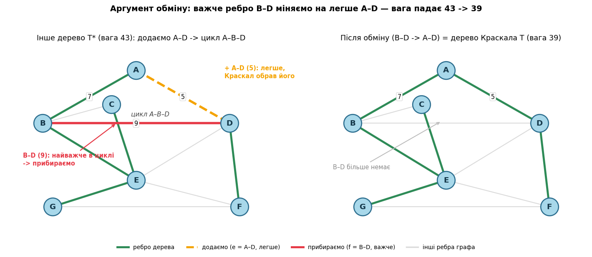

<a id="sec18"></a>

## 18. Conclusions

We have walked the whole path: from the definition of an MST to a working Kruskal implementation and to understanding **why** it is fast and **why** it gives the correct result. Here is what to take away.

### The main idea

Kruskal itself is trivial: sort the edges and take the lightest one that does not form a cycle. All the complexity and all the elegance hide in a single question — **"are vertices $u$ and $v$ already connected right now?"**. The speed depends precisely on the answer to it:

- naively (`nx.has_path`) — we **traverse the graph** anew every time: $O(V+E)$ per edge;
- via **DSU** — we simply compare two roots: $\approx O(1)$.

Because of this, the same algorithm runs either in $O(E \cdot (V+E))$ or in $O(E \log E)$. The lesson is broader than Kruskal: **the right data structure transforms an algorithm's complexity**, even when the algorithm itself does not change.

### What we found out along the way

- **Correctness — proved, not guessed.** The greedy choice rests on the **cut** property (the lightest edge across a cut is safe) and the **cycle** property (the heaviest edge of a cycle is redundant). The exchange argument shows: any other tree can be pulled toward Kruskal's without increasing the weight.
- **Complexity — $O(E \log E)$,** and what dominates here is **sorting the edges**, not the cycle check — which is almost free thanks to DSU with path compression and union by rank ($O(\alpha(n))$).
- **The empirics match the theory — but honestly.** On tiny graphs there is almost no difference (because of overhead DSU can even be a touch slower). On bigger ones it wins dramatically, tens to hundreds of times. Individual measurements "jump" (cache, GC, a single run), so the reliable guide is not a specific number but the **asymptotics**: $O(E \log E)$ vs $O(E\cdot(V+E))$.

### Practical notes

- **DSU is a tool, not a detail of Kruskal.** The same "in the same group?" is needed everywhere: connected components, clustering, "will this close a cycle", dynamic edge addition. It's worth keeping in mind as a separate building block.
- **Kruskal is convenient when edges are easy to enumerate** (a ready list of edges, a sparse graph). For dense graphs Prim is often handier — it grows "from a vertex", without sorting all the edges.
- **Beware of "naive but correct".** `nx.has_path` gives the right answer — and quietly turns an expected-fast algorithm into a quadratic one. Correctness ≠ efficiency.

> **In one line:** Kruskal = sorting + greed, and all the speed magic is that DSU answers "already connected?" almost instantly.
