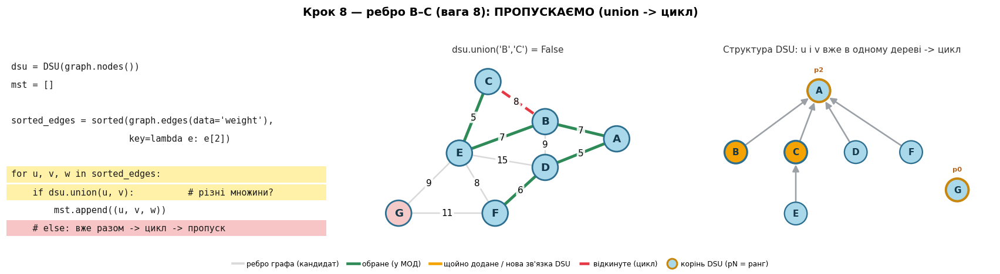

# 🌳 Алгоритм Краскала: мінімальне остовне дерево

**Мінімальне остовне дерево (МОД, *Minimum Spanning Tree*)** — це підмножина ребер
зваженого неорієнтованого графа, яка:

1. **з'єднує всі вершини** (остовне = охоплює весь граф),
2. **не містить циклів** (дерево),
3. має **найменшу можливу сумарну вагу** серед усіх таких підмножин.


---

## Зміст

1. [Що таке мінімальне остовне дерево](#sec1)
2. [Що таке компонента зв'язності](#sec2)
3. [Ідея алгоритму Краскала](#sec3)
4. [Побудова та візуалізація графа](#sec4)
5. [Реалізація Краскала через `nx.has_path`](#sec5)
6. [Покрокова візуалізація лекційного варіанту (forest + has_path)](#sec6)
7. [Структура даних Union-Find (DSU)](#sec7)
8. [Чому DSU краще за `nx.has_path`](#sec8)
9. [Емпіричний бенчмарк: DSU проти `nx.has_path`](#sec9)
10. [Порівняння `nx.has_path` проти DSU на одному кроці](#sec10)
11. [Як працює BFS усередині `nx.has_path`](#sec11)
12. [BFS для випадку додавання: ціль недосяжна (E–G)](#sec12)
13. [Звідки взялася структура DSU на кроці 8](#sec13)
14. [Реалізація алгоритму Краскала](#sec14)
15. [Покрокова DSU-версія: код, граф і структура DSU](#sec15)
16. [Усі кроки на одному малюнку (підсумок)](#sec16)
17. [Чому алгоритм працює правильно](#sec17)
18. [Висновки](#sec18)
19. [Структура репозиторію](#sec-repo)
20. [Встановлення та запуск](#sec-install)

---

Коротко про шлях: розбираємо **жадібну ідею** Краскала, реалізуємо його двома способами —
наївно через `nx.has_path` і ефективно через **Union-Find (DSU)**, **покроково візуалізуємо**
кожне рішення (яке ребро додано, яке відкинуто як цикл, як зливаються компоненти),
**доводимо коректність** через властивості розрізу та циклу і нарешті аналізуємо
**складність**, підтверджуючи її **бенчмарком**.

> Працюємо з тим самим графом, що й у методичці курсу, щоб результати можна було звірити.

---

<a id="sec1"></a>

## 1. Що таке мінімальне остовне дерево

Нехай маємо зважений неорієнтований граф $G = (V, E)$, де $V$ — множина вершин,
$E$ — множина ребер, і кожному ребру $e$ зіставлено вагу $w(e)$.

**Остовне дерево** графа — це дерево, що містить **усі** вершини $V$ і є підграфом $G$.
Будь-яке дерево на $n = |V|$ вершинах має рівно $n-1$ ребро, і між будь-якою парою
вершин існує **єдиний** шлях (тому немає циклів).

**Мінімальне остовне дерево** — це остовне дерево з найменшою сумарною вагою ребер:

$$w(T) = \sum_{e \in T} w(e) \;\to\; \min$$

**Важливі факти:**

- МОД існує тоді й лише тоді, коли граф **зв'язний**.
- Якщо ваги ребер **не унікальні**, МОД може бути **кілька** (з однаковою сумарною вагою).
- МОД завжди має рівно $|V| - 1$ ребро.

**Де застосовується:** проєктування мереж (мінімум кабелю / труб / доріг для зв'язку
всіх точок), кластеризація даних, апроксимації задачі комівояжера, сегментація зображень.

### Що таке остовне дерево — на пальцях

Те заплутане речення насправді складене з трьох окремих ідей. Розберемо кожну.

**Уяви метафору.** Є $n$ міст. Ми хочемо прокласти дороги так, щоб з будь-якого
міста можна було доїхати до будь-якого іншого — але **без зайвих, дублюючих доріг**
(без кілець). Найекономніший такий набір доріг і є **остовне дерево**.

Тепер по словах із означення:

- **«остовне»** — від слова *остов* (скелет, каркас). Дерево «накриває» **всі**
  вершини: жодне місто не лишилось відрізаним.
- **«дерево»** — це зв'язний граф **без циклів**. Як гілки дерева: розгалужуються,
  але ніколи не змикаються в кільце.
- **«підграф $G$»** — ми не вигадуємо нові дороги, а беремо лише ті ребра, що вже
  є в графі $G$.

#### Факт 1: рівно $n-1$ ребро

Щоб з'єднати $n$ міст, потрібно **рівно $n-1$ дорогу**:

- якщо доріг **менше** ($< n-1$) — хтось обов'язково лишиться відрізаним;
- якщо доріг **більше** ($> n-1$) — з'явиться зайва дорога, яка замкне кільце (цикл).

Дерево — це точна «золота середина»: усе зв'язано, але жодної зайвої дороги.

#### Факт 2: між будь-якою парою вершин — рівно один шлях

У дереві з одного міста в інше веде **рівно один** маршрут. Чому?

- **Хоча б один** шлях є завжди — бо граф зв'язний.
- **Не більше одного** — бо якби існувало **два різні** маршрути між $u$ і $v$, то,
  пройшовши «туди» одним, а «назад» другим, ми б замкнули **кільце (цикл)**. А в
  дереві циклів немає. Отже, шлях рівно один.

Тому «єдиний шлях» і «немає циклів» — це **те саме твердження**, сказане двома способами.

#### Конкретний приклад

Граф $G$ — 4 міста $\{A, B, C, D\}$ і 5 доріг: $A\!-\!B,\; A\!-\!C,\; B\!-\!C,\; C\!-\!D,\; B\!-\!D$.
У ньому є кільця (наприклад, $A\!-\!B\!-\!C\!-\!A$), тож це **не** дерево.

Одне з його остовних дерев: $T = \{A\!-\!B,\; A\!-\!C,\; C\!-\!D\}$ — ті самі 4 вершини,
але вже **3 ребра** ($= n-1$) і **жодного циклу**. Подивимось на це нижче.

```python
import networkx as nx

# Граф G: 4 міста і 5 доріг (є цикли)
G = nx.Graph()
G.add_edges_from([("A", "B"), ("A", "C"), ("B", "C"), ("C", "D"), ("B", "D")])

# Одне з його остовних дерев: 3 ребра, без циклів
T = nx.Graph(); T.add_nodes_from(G.nodes())
T.add_edges_from([("A", "B"), ("A", "C"), ("C", "D")])

print(nx.is_tree(T))                                # True
print(T.number_of_edges())                          # 3   (= n - 1)
print(len(list(nx.all_simple_paths(T, "A", "D"))))  # 1   (єдиний шлях A → C → D)
print(nx.cycle_basis(G), "vs", nx.cycle_basis(T))   # у G цикли є, у T — немає
```

### Звідки береться «рівно $n-1$» — і до чого тут Краскал

Найкраще це видно через **компоненти зв'язності** — і це рівно та сама логіка, що
працює в алгоритмі Краскала:

1. Спочатку маємо $n$ окремих міст і **0 доріг** — це $n$ окремих компонент.
2. Будуємо дорогу між двома **різними** компонентами → їх стає на одну менше.
3. Кожна така «корисна» дорога зменшує число компонент рівно на 1.
4. Щоб дійти від $n$ компонент до **однієї** (всі з'єднані), треба рівно $n - 1$ дорогу.

А якщо побудувати дорогу між містами, які **вже в одній компоненті**, число компонент
**не зміниться** — натомість з'явиться **цикл**. Саме таке ребро Краскал і пропускає.

Тобто остовне дерево — це і є той набір з рівно $n-1$ «корисних» ребер, кожне з яких
зливає дві компоненти, і жодного «зайвого», що утворює цикл.

<a id="sec2"></a>

## 2. Що таке компонента зв'язності

**Компонента зв'язності** — це група вершин, у якій від будь-якої вершини можна
дійти до будь-якої іншої, рухаючись по ребрах. І це **максимальна** така група:
до неї не можна додати жодної вершини, не втративши цю властивість.

**Метафора — архіпелаг островів.** Уяви, що вершини — це міста, а ребра — мости.
Тоді компонента зв'язності — це **острів**: група міст, з'єднаних мостами.

- Усередині острова можна доїхати з будь-якого міста в будь-яке.
- Між різними островами доїхати **не можна** — між ними немає мостів.

Граф може складатися з **однієї** компоненти (усе з'єднано) або з **кількох**
окремих «острівців».

**Зв'язок із `has_path`:** `nx.has_path(G, u, v)` повертає `True` тоді й лише тоді,
коли `u` і `v` — в **одній** компоненті (на одному острові).

```python
import networkx as nx

G = nx.Graph()
G.add_edges_from([("A", "B"), ("B", "C"), ("A", "C")])   # трикутник
G.add_edges_from([("D", "E"), ("E", "F")])               # ланцюжок
G.add_node("G")                                          # самотня вершина

print(nx.number_connected_components(G))   # 3
print(nx.has_path(G, "A", "C"))            # True  — та сама компонента
print(nx.has_path(G, "A", "D"))            # False — різні компоненти
print(nx.has_path(G, "D", "G"))            # False — різні компоненти
```

### Як це працює в алгоритмі Краскала

Саме навколо компонент усе й крутиться:

1. **На початку** ліс не має ребер → кожна вершина сама собі компонента
   (n окремих островів по одному місту).
2. Додати ребро між **різними** компонентами = побудувати міст → два острови
   **зливаються** в один.
3. Додати ребро всередині **однієї** компоненти = зайвий міст → утворився б
   **цикл** → таке ребро пропускаємо.
4. **У кінці** всі вершини в одній компоненті (увесь граф з'єднано) — це і є
   остовне дерево.

Тому в покроковій візуалізації **колір вершини = її компонента**: ти бачиш, як
острівці поступово зливаються в один, коли додаються ребра.

<a id="sec3"></a>

## 3. Ідея алгоритму Краскала

Краскал — **жадібний** алгоритм. Жадібність тут проста: *завжди бери найдешевше ребро,
яке ще можна взяти, не утворивши цикл.*

**Кроки:**

1. **Сортуємо** всі ребра за зростанням ваги.
2. **Ініціалізуємо ліс**: спочатку кожна вершина — окреме дерево (окрема компонента
   зв'язності). Дерева у нас ще немає, лише $|V|$ ізольованих вершин.
3. **Проходимо ребра** від найлегшого до найважчого. Для кожного ребра $(u, v)$:
   - якщо $u$ і $v$ лежать у **різних** компонентах → додаємо ребро до МОД і **зливаємо**
     ці компоненти в одну;
   - якщо $u$ і $v$ вже в **одній** компоненті → ребро утворило б **цикл**, тож **пропускаємо** його.
4. **Зупиняємось**, коли в дереві назбиралось $|V| - 1$ ребро (решту ребер можна навіть не дивитись).

**Ключове спостереження.** Усе впирається в одне питання: *«чи лежать $u$ і $v$ у одній
компоненті?»*. Якщо так — ребро дає цикл. Це питання треба вміти ставити **дуже швидко** і
**багато разів**.

Перевірку циклу можна реалізувати через `nx.has_path(forest, u, v)` — тобто щоразу
запускається обхід графа. Це **коректно, але повільно**.

Для більшої швидкості існує структура **Union-Find**.

Нижче 2 варіанти реалізації із поясненнями.

<a id="sec4"></a>

## 4. Побудова та візуалізація графа

Подивимось на вихідний граф, для якого шукатимемо МОД:

```python
import networkx as nx

def build_graph():
    # Той самий зважений граф, що й у методичці курсу.
    G = nx.Graph()
    edges = [
        ("A", "B", 7), ("A", "D", 5), ("B", "C", 8), ("B", "D", 9),
        ("B", "E", 7), ("C", "E", 5), ("D", "E", 15), ("D", "F", 6),
        ("E", "F", 8), ("E", "G", 9), ("F", "G", 11),
    ]
    for u, v, w in edges:
        G.add_edge(u, v, weight=w)
    return G

G = build_graph()
print(f"Граф побудовано: {G.number_of_nodes()} вершин, {G.number_of_edges()} ребер.")
```


<a id="sec5"></a>

## 5. Як працює реалізація Краскала через `nx.has_path`

У цієї реалізації є **три рухомі частини**:

1. **`sorted_edges`** — усі ребра, відсортовані за вагою (від найлегшого).
   Краскал завжди намагається взяти найдешевше ребро першим.
2. **`forest`** — допоміжний граф, що відстежує **компоненти зв'язності**.
   Спочатку це просто всі вершини без жодного ребра (кожна вершина — окрема компонента).
   Щоразу, коли ми додаємо ребро в МОД, ми додаємо його **і** в `forest`, тож `forest`
   завжди «пам'ятає», що з чим уже з'єднано.
3. **`nx.has_path(forest, u, v)`** — запитує: «чи вже існує шлях між `u` і `v`?».
   Це і є перевірка на цикл.

**Головна ідея перевірки циклу.** Нове ребро `u–v` утворить цикл **тоді й лише тоді**,
коли `u` і `v` **вже з'єднані** (між ними вже є шлях). Тому:

- `has_path` повертає **False** → шляху ще немає → вершини в **різних** компонентах →
  ребро безпечне → **додаємо** його;
- `has_path` повертає **True** → шлях уже є → вершини в **одній** компоненті →
  ребро замкнуло б цикл → **пропускаємо**.

Це рівно та сама логіка «компонент», що й при означенні остовного дерева: `forest` —
це бухгалтерія, а `has_path` — запит до неї.

```python
import networkx as nx

def kruskal_mst(graph):
    # === КРОК 1: ліс із самих лише вершин (поки без ребер) ===
    # forest відстежує компоненти зв'язності. Спочатку кожна вершина —
    # окрема компонента (окреме "дерево" лісу).
    forest = nx.Graph()
    for node in graph.nodes():
        forest.add_node(node)              # додаємо всі вершини, ребер ще немає

    # === КРОК 2: сортуємо ребра за вагою (від найлегшого) ===
    # graph.edges(data=True) дає кортежі виду (u, v, {'weight': w}).
    # key=lambda t: t[2].get('weight', 1) бере вагу з третього елемента
    # (зі словника атрибутів); якщо ваги раптом немає — вважає її рівною 1.
    sorted_edges = sorted(graph.edges(data=True),
                          key=lambda t: t[2].get('weight', 1))

    mst = nx.Graph()                       # майбутнє мінімальне остовне дерево

    # === КРОК 3: проходимо ребра від найлегшого до найважчого ===
    for edge in sorted_edges:
        u, v, attr = edge
        # has_path == False  =>  між u і v ще немає шляху  =>  вони в РІЗНИХ
        # компонентах  =>  ребро НЕ створить цикл  =>  беремо його
        if not nx.has_path(forest, u, v):
            forest.add_edge(u, v)                       # з'єднуємо компоненти у лісі
            mst.add_edge(u, v, weight=attr['weight'])   # число дістаємо за ключем 'weight'
        # інакше (шлях уже є) u і v у ОДНІЙ компоненті => ребро дало б цикл => пропускаємо

    return mst
```

### Дві тонкощі цього коду

**Тонкість 1: чому `attr['weight']`, а не просто `weight`?**

`graph.edges(data=True)` повертає кожне ребро як кортеж із **трьох** елементів:
`(u, v, attr)`, де `attr` — це **словник атрибутів**. Наприклад, для ребра A–B:

Тому розпакування `u, v, weight = edge` дає:

- `u = 'A'`
- `v = 'B'`
- `attr = {'weight': 7}`  ← це **словник**!

Саме тому, щоб дістати число `7`, у коді пишуть `attr['weight']` (звертаються до
словника за ключем `'weight'`).

**Тонкість 2: чому `if not nx.has_path(...)` означає «немає циклу»?**

`forest` накопичує рівно ті ребра, які вже потрапили в МОД. Тому питання
«чи є шлях між `u` і `v` у `forest`?» = «чи вони вже в одній компоненті?».

- немає шляху (`has_path == False`) → різні компоненти → ребро **з'єднує дві окремі
  частини**, циклу не буде → додаємо;
- шлях є (`has_path == True`) → одна компонента → ребро **замкнуло б петлю** → пропускаємо.

Тобто `not has_path` — це і є умова «додавання ребра не створить цикл».

Прогнавши цей код на нашому графі, отримаємо МОД вагою **39**. Те саме рішення зручно
звести в таблицю (ребра — за зростанням ваги, рішення приймається згори вниз):

| № | Ребро | Вага | Рішення | Чому |
|--:|:-----:|:----:|:--------|:-----|
| 1 | A–D | 5 | ✅ додано | об'єднує {A} та {D} |
| 2 | C–E | 5 | ✅ додано | об'єднує {C} та {E} |
| 3 | D–F | 6 | ✅ додано | об'єднує {A, D} та {F} |
| 4 | A–B | 7 | ✅ додано | об'єднує {A, D, F} та {B} |
| 5 | B–E | 7 | ✅ додано | об'єднує {A, B, D, F} та {C, E} |
| 6 | B–C | 8 | ❌ цикл | B і C вже в одній компоненті |
| 7 | E–F | 8 | ❌ цикл | E і F вже в одній компоненті |
| 8 | B–D | 9 | ❌ цикл | B і D вже в одній компоненті |
| 9 | E–G | 9 | ✅ додано | приєднує {G} — **дерево готове (6 ребер)** |
| 10 | F–G | 11 | — | не розглядається (вже зібрано $\|V\|-1=6$ ребер) |
| 11 | D–E | 15 | — | не розглядається |

**Сумарна вага:** $5 + 5 + 6 + 7 + 7 + 9 = \mathbf{39}$.

<a id="sec6"></a>

## 6. Покрокова візуалізація лекційного варіанту (forest + has_path)

Покроково алгоритм показано **по одній панелі на кожен крок алгоритму**. На кожній панелі:

- **ліворуч** — код алгоритму, де підсвічено рядки, що **спрацьовують саме на цьому кроці**;
- **праворуч** — граф, що показує, **що цей фрагмент коду робить** зі станом.

**Підсвічування коду:**
- 🟡 жовтий — рядок виконується зараз;
- 🟢 зелений — спрацювала гілка «додати ребро»;
- 🔴 червоний — спрацювала гілка «пропустити (цикл)».

**Граф:**
- колір вершини = її **компонента зв'язності** (різні кольори — різні компоненти);
- сірі ребра — ще не використані; зелені — вже у МОД;
- 🟧 помаранчеве — ребро, яке щойно **додали**; 🔴 червоне пунктирне — ребро, яке **відкинули** (цикл).

Усього виходить 13 панелей: ініціалізація лісу, сортування ребер, і далі по одній на кожне
з 11 ребер. Зверни увагу: цей варіант перевіряє **всі** ребра — навіть `F–G` і `D–E` після
того, як дерево вже зібране на кроці 11 (вони просто відкидаються як цикли).

### Чому на кроці 8 ребро B–C пропускається

**Правило Краскала:** ребро пропускаємо, якщо його кінці **вже в одній компоненті** —
бо тоді воно лише замкнуло б цикл, а в дереві циклів бути не може.

На кроці 8 перевіряємо B–C, і `has_path(forest, 'B', 'C') = True`. Звідки B і C вже
з'єднані? Подивимось, що додалося на попередніх кроках:

- **крок 4:** додали `C–E` → C і E опинились в одній компоненті;
- **крок 7:** додали `B–E` → B приєднався до тієї ж компоненти через E.

Отже, B і C **вже з'єднані через E**: існує шлях **B → E → C** по вже доданих
(зелених) ребрах. Перед кроком 8 уся компонента — це `{A, B, C, D, E, F}`, і B та C
обидва в ній.

Якби ми зараз додали пряме ребро B–C, воно замкнуло б трикутник —
**цикл B → E → C → B**. Тому `has_path` повертає `True`, і ребро відкидається.

Простими словами: B і C уже на одному «острові», з'єднані через E. Прямий міст B–C
нічого нового не з'єднує — він лише створив би зайву петлю.

### Підсумок

Результат коректний: МОД вагою **39** з ребрами A–D, A–B, D–F, C–E, E–B, E–G. Алгоритм
працює правильно, бо щоразу бере найлегше ребро, яке не утворює цикл — а це і є жадібний
шлях до остовного дерева мінімальної ваги.

Єдина слабкість — **швидкодія**. `nx.has_path(forest, u, v)` щоразу запускає обхід графа,
щоб дати відповідь «чи в одній компоненті?». Це коректно, але повільно: на кожне з $E$
ребер витрачається до $O(V + E)$.

Це питання ставить `DSU.find(u) == DSU.find(v)` — і відповідає **майже миттєво**
(амортизовано $\approx O(1)$). Логіка ідентична — змінюється лише структура, що відстежує
компоненти. Тому DSU-версія дає **той самий результат**, але масштабується незрівнянно краще.

<a id="sec7"></a>

## 7. Структура даних Union-Find (система неперетинних множин, DSU)

**Union-Find**, він же **DSU** (*Disjoint Set Union*), — це структура даних, яка зберігає
розбиття елементів на **неперетинні множини** (кожен елемент належить рівно одній множині)
і вміє швидко робити дві речі:

- **`find(x)`** — повертає «представника» (корінь) множини, до якої належить `x`.
  Двоє елементів у одній множині **тоді й лише тоді**, коли в них однаковий представник.
- **`union(a, b)`** — зливає дві множини, що містять `a` і `b`, в одну.

Звідси випливає головний запит: «чи `a` і `b` в одній множині?» — це просто
`find(a) == find(b)`.

### Чому це ідеально лягає на Краскал

У Краскалі множини — це **компоненти зв'язності**:

| Поняття Краскала | Операція DSU |
|:--|:--|
| «чи `u` і `v` вже в одній компоненті?» (чи буде цикл) | `find(u) == find(v)` |
| додати ребро, з'єднавши дві компоненти | `union(u, v)` |
| на початку кожна вершина — окрема компонента | `DSU(вершини)` |

Тобто весь «бухгалтерський» бік Краскала — це рівно дві операції DSU.

### Як DSU влаштований усередині: ліс із вказівників на батька

DSU зберігає кожну множину як **дерево вказівників**: кожен елемент пам'ятає свого
**батька** (`parent`). Елемент, який є сам собі батьком, — це **корінь** (представник множини).

- **`find(x)`** = піднятись по вказівниках `parent` до кореня.
- **`union(a, b)`** = знайти корені обох множин і **підвісити один корінь під інший**.
- **На старті** кожен елемент — сам собі корінь: маємо $n$ окремих дерев по одному вузлу.

Важливо: це **не** ребра вихідного графа, а внутрішня службова структура DSU — вона лише
відповідає на питання «хто з ким в одній множині».

### Дві оптимізації, що роблять DSU майже миттєвим

Якщо робити `union` наївно (підвішувати як попало), дерево може **вирости в довгий
ланцюг**, і тоді `find` доведеться долати $O(n)$ кроків — повільно. Цьому запобігають
дві оптимізації:

1. **Об'єднання за рангом** (*union by rank*) — менше/нижче дерево підвішуємо під більше.
   Так дерева лишаються неглибокими.
2. **Стиснення шляху** (*path compression*) — під час `find` усі пройдені вузли одразу
   перепідвішуємо прямо до кореня. Дерево «сплющується».

Разом вони дають амортизовану складність $O(\alpha(n))$ на операцію, де $\alpha$ —
обернена функція Аккермана. Для будь-яких реальних $n$ маємо $\alpha(n) \le 4$, тобто
фактично **константа**. Нижче — як це виглядає.

```python
class DSU:
    # Система неперетинних множин з об'єднанням за рангом і стисненням шляху.

    def __init__(self, vertices):
        self.parent = {v: v for v in vertices}   # кожен сам собі корінь
        self.rank   = {v: 0 for v in vertices}   # наближена «висота» дерева

    def find(self, x):
        # 1) піднімаємось до кореня
        root = x
        while self.parent[root] != root:
            root = self.parent[root]
        # 2) стиснення шляху: усіх на шляху чіпляємо одразу до кореня
        while self.parent[x] != root:
            self.parent[x], x = root, self.parent[x]
        return root

    def union(self, a, b):
        ra, rb = self.find(a), self.find(b)
        if ra == rb:
            return False                          # вже в одній множині — нічого не робимо
        # менший ранг підвішуємо під більший
        if self.rank[ra] < self.rank[rb]:
            ra, rb = rb, ra
        self.parent[rb] = ra
        if self.rank[ra] == self.rank[rb]:
            self.rank[ra] += 1
        return True                               # множини реально злились
```

Невелика перевірка роботи:

```python
d = DSU(["A", "B", "C", "D"])
print("A та B спочатку разом?", d.find("A") == d.find("B"))   # False
d.union("A", "B")
print("Після union(A, B) разом? ", d.find("A") == d.find("B"))  # True
print("A та C разом?           ", d.find("A") == d.find("C"))   # False
```

### Анімація: як DSU будується зсередини

Ця анімація на 5 елементах показує **внутрішню структуру** DSU крок за кроком: спочатку
кілька `union` (із **об'єднанням за рангом**), а потім `find(D)` зі **стисненням шляху**.

Що означають позначення:
- **стрілка** веде від вузла до його **батька** (`parent`);
- **золота рамка** = корінь (вузол, що показує сам на себе); біля кореня написано його **ранг**;
- **помаранчевий** = вузол, де ми зараз під час `find`; **зелений** = знайдений корінь.

На що дивитися:
- **Кроки 2–5 (union):** коли два корені мають **рівні** ранги — один підвішуємо під інший,
  і ранг нового кореня зростає на 1; коли **різні** — менший під більший (ранг не росте).
  Після `union(A, C)` вузол **D опиняється на глибині 2**: D → C → A.
- **Кроки 6–9 (find):** піднімаємось від D по стрілках до кореня (D → C → A), а потім
  **стиснення шляху** перепідвішує D **прямо до кореня A** — тепер D дістається кореня за
  1 стрибок. Саме це й тримає дерева пласкими, а `find` — швидким.


https://github.com/user-attachments/assets/ac0897b4-e85e-4c5b-b60d-031326df973d


<!-- ▶️ ВІДЕО З КОНТРОЛЕРАМИ (play / пауза / перемотка) — необов'язкове, замість/на додачу до GIF:
     1) згенеруй файли:  python scripts/generate_images.py   (створить images/dsu_build.gif і .mp4)
     2) на github.com відкрий цей README у режимі ✏️ Edit;
     3) перетягни файл images/dsu_build.mp4 прямо в текст — GitHub завантажить його й вставить
        рядок виду  https://github.com/<user>/<repo>/assets/.../dsu_build.mp4
     4) встав цей рядок ось сюди, окремим рядком — GitHub сам зробить з нього відеоплеєр із контролерами.
     GIF вище працює одразу й усюди (репозиторій, локальний прев'ю, PyPI), але без кнопок керування. -->

<a id="sec8"></a>

## 8. Чому DSU краще за `nx.has_path` у Краскалі

Обидва підходи відповідають на одне питання — «чи `u` і `v` вже з'єднані?» — але механізм
у них принципово різний.

**`nx.has_path(forest, u, v)`** запускає **обхід графа** (BFS/DFS) від `u`, поки не знайде
`v` або не обійде весь ліс:

- один виклик коштує $O(V + E)$;
- виклик **нічого не запам'ятовує** — наступного разу обхід починається з нуля.

**DSU** натомість **тримає структуру компонент і оновлює її інкрементально**:

- `find(u)` / `find(v)` та `union` коштують $\approx O(\alpha(V)) \approx O(1)$ — майже миттєво;
- стан зберігається між викликами, нічого не переобчислюється.

**Суть різниці:** `has_path` **щоразу переобчислює** зв'язність з нуля, обходячи весь ліс;
DSU **тримає** її в пам'яті й відповідає майже миттєво. Що більший граф — то повільніший
`has_path` (більше обходити), тоді як DSU лишається швидким. Тому розрив **зростає** з
розміром графа.

### Складність усього Краскала

Позначимо $V = |V|$, $E = |E|$. Будь-яка версія алгоритму = **відсортувати ребра** +
**$E$ перевірок «цикл / не цикл»**. Уся різниця — у вартості однієї перевірки:

| Перевірка циклу | Сортування | $E$ перевірок | Разом |
|:--|:--|:--|:--|
| `nx.has_path` | $O(E \log E)$ | $O(E \cdot (V + E))$ | $O(E \cdot (V + E))$ — домінують перевірки |
| **DSU** | $O(E \log E)$ | $O(E \cdot \alpha(V)) \approx O(E)$ | $O(E \log E)$ — домінує сортування |

У версії з DSU перевірки стають майже безкоштовними ($\approx O(E)$), тож час визначає
лише сортування ребер — а це **оптимально** для алгоритму, який мусить переглянути всі
ребра. (Оскільки в простому графі $E < V^2$, маємо $\log E < 2\log V$, тому еквівалентно
пишуть $O(E \log E) = O(E \log V)$.)

**Пам'ять:** $O(V + E)$.

`nx.has_path` — один рядок, без зайвих структур, чудовий для крихітних графів і щоб
зрозуміти ідею. Але на реальних розмірах правильний інструмент — DSU. Перевіримо різницю
на числах.

<a id="sec9"></a>

## 9. Емпіричний бенчмарк: DSU проти `nx.has_path`

Порівняємо дві реалізації на випадкових зв'язних графах зростаючого розміру. Спочатку
переконаємось, що **обидві дають однакову вагу МОД**, а потім поміряємо час.

```python
import time, random
import networkx as nx

def kruskal_dsu(G):
    # Швидка реалізація (через Union-Find). Повертає вагу МОД.
    dsu = DSU(G.nodes())
    total, cnt, need = 0, 0, G.number_of_nodes() - 1
    for u, v, w in sorted(G.edges(data="weight"), key=lambda e: e[2]):
        if dsu.union(u, v):
            total += w; cnt += 1
            if cnt == need:
                break
    return total

def kruskal_naive(G):
    # Реалізація з лекції: перевірка циклу через nx.has_path. Повертає вагу МОД.
    forest = nx.Graph()
    forest.add_nodes_from(G.nodes())
    total = 0
    for u, v, w in sorted(G.edges(data="weight"), key=lambda e: e[2]):
        if not nx.has_path(forest, u, v):     # немає шляху => ребро не дасть циклу
            forest.add_edge(u, v)
            total += w
    return total

def random_connected(n, seed):
    # Випадковий зв'язний зважений граф: кістяк-дерево + ~n додаткових ребер.
    rng = random.Random(seed)
    G = nx.random_labeled_tree(n, seed=seed)   # дерево => гарантована зв'язність
    nodes = list(G.nodes())
    added = 0
    while added < n:
        u, v = rng.sample(nodes, 2)
        if not G.has_edge(u, v):
            G.add_edge(u, v); added += 1
    for u, v in G.edges():
        G[u][v]["weight"] = rng.randint(1, 100)
    return G
```

```python
# 1) Перевірка коректності: обидві реалізації дають однакову вагу МОД
for s in range(5):
    g = random_connected(40, s)
    assert kruskal_dsu(g) == kruskal_naive(g)
print("Коректність: на 5 випадкових графах обидві реалізації дали однакову вагу МОД ✔")

# 2) Таблиця часу
for n in [50, 100, 200, 400, 600]:
    g = random_connected(n, 123)
    t0 = time.perf_counter(); kruskal_dsu(g);   td = (time.perf_counter() - t0) * 1000
    t0 = time.perf_counter(); kruskal_naive(g); tn = (time.perf_counter() - t0) * 1000
    print(f"{n:>4} вершин | DSU {td:8.3f} мс | naive {tn:9.3f} мс | прискорення {tn/td:5.1f}×")
```


На крихітних графах різниці майже немає (через накладні витрати DSU може бути навіть трохи
повільнішим). На більших графах DSU виграє драматично, а розрив зростає — рівно як і
передбачає асимптотика $O(E \log E)$ проти $O(E \cdot (V + E))$.

<a id="sec10"></a>

## 10. Порівняння `nx.has_path` проти DSU на одному кроці

Візьмемо **те саме питання** — «чи B і C вже з'єднані?» — на кроці 8 (ребро B–C) і
зробимо його **двома способами поряд**. Перед цим у лісі вже є ребра
A–D, C–E, D–F, A–B, B–E, тож B і C насправді в одній компоненті.

- **Ліворуч — `nx.has_path`:** він **крокує по графу** (BFS), стрибаючи з вершини на
  вершину по ребрах, поки не натрапить на C. Працює з **лісом-графом** (реальні ребра
  між вершинами).
- **Праворуч — DSU:** він просто **дивиться на «мітку групи» (корінь)** вершини B і
  вершини C, піднімаючись по вказівниках `parent` (1–2 стрибки), і порівнює їх. Працює
  з **пласким деревом вказівників** (кожна вершина показує на свого представника).

Тобто це не лише різна швидкість — це **різні структури** й **різний вид роботи**:
«пройти граф» проти «звірити дві мітки».


<a id="sec11"></a>

## 11. Як працює BFS усередині `nx.has_path`

**BFS** (Breadth-First Search, пошук у ширину) — це спосіб обійти граф «хвилями» від
стартової вершини. Тут він відповідає на питання: *«чи можна дійти від B до C по ребрах?»*

Головний інструмент — **черга** (принцип FIFO: хто першим зайшов, того першим обробляємо):

1. Кладемо стартову вершину (**B**) у чергу й позначаємо відвіданою.
2. Беремо вершину з **початку** черги — це поточна вершина, яку «обробляємо».
3. Дивимось її **сусідів** — вершини, з'єднані з нею **ребром**. Кожного ще не відвіданого
   сусіда позначаємо відвіданим і кладемо в **кінець** черги.
4. Якщо серед сусідів трапилась ціль (**C**) — стоп, шлях знайдено.
5. Інакше повертаємось до кроку 2 — поки черга не спорожніє.

**Чому «стрибає по ребрах»?** BFS може перейти з вершини **лише до її сусіда** — тобто
туди, куди веде **пряме ребро**. Без ребра переходу немає. Тому пошук «повзе» графом
виключно вздовж наявних ребер, вершина за вершиною.

**Чому «ліс-граф»?** `has_path` викликається на `forest` — графі, де є **лише ребра,
вже додані до МОД**. Тож BFS блукає саме цими реальними ребрами. На анімації: сірі
суцільні — ребра лісу (по них можна йти), а ледь помітні пунктирні — ребра вихідного
графа, яких у лісі ще **немає** (по них іти не можна).

**Два можливі результати пошуку:**

- дійшли до **C** → шлях є → B і C в одній компоненті → ребро B–C дало б **цикл**;
- черга спорожніла, а C так і не знайшли → шляху немає → різні компоненти → ребро **можна додати**.


https://github.com/user-attachments/assets/d7326e5c-f650-4d40-ad8b-a5baa1f0aa99


<!-- ▶️ ВІДЕО З КОНТРОЛЕРАМИ — за бажанням, замість/на додачу до GIF:
     1) згенеруй:  python scripts/generate_images.py   (створить images/bfs_found.gif і .mp4)
     2) на github.com відкрий README у ✏️ Edit і перетягни images/bfs_found.mp4 у текст;
     3) GitHub підставить рядок https://github.com/<user>/<repo>/assets/.../bfs_found.mp4 — встав його сюди окремим рядком. -->

<a id="sec12"></a>

## 12. BFS для випадку додавання: ціль недосяжна (Крок 11. E–G)

Тепер протилежний випадок: перевіряємо ребро **E–G**, але **G — в окремій компоненті**
(до нього ще немає жодного ребра в лісі). BFS стартує з E і шукає G.

Найважливіше тут: оскільки шляху **немає**, BFS **не може зупинитися раніше** — йому
доводиться обійти **всю** компоненту {A, B, C, D, E, F}, перш ніж переконатися, що G
недосяжна. Тобто випадок «додавання» — це **найгірший** для `has_path`: максимум роботи.

Коли черга нарешті порожніє, а G так і не знайдено → шляху немає → E і G у **різних**
компонентах → ребро E–G **безпечно додати** (циклу не буде).

> Для порівняння: DSU відповів би на це за 2 стрибки — `find(E) ≠ find(G)` — взагалі нічого
> не обходячи. Саме тут різниця у швидкості найвідчутніша.


https://github.com/user-attachments/assets/378874d0-b067-489c-8815-c46e4a495e22


<!-- ▶️ ВІДЕО З КОНТРОЛЕРАМИ — за бажанням, замість/на додачу до GIF:
     1) згенеруй:  python scripts/generate_images.py   (створить images/bfs_notfound.gif і .mp4)
     2) на github.com відкрий README у ✏️ Edit і перетягни images/bfs_notfound.mp4 у текст;
     3) GitHub підставить рядок https://github.com/<user>/<repo>/assets/.../bfs_notfound.mp4 — встав його сюди окремим рядком. -->

<a id="sec13"></a>

## 13. Звідки взялася ця структура DSU на кроці 8 (анімація)

Структура на правій панелі (A — корінь; B, C, D, F → A; E → C; G окремо) не випадкова —
вона **побудувалася з тих 5 ребер, які додались до МОД** перед кроком 8:
A–D, C–E, D–F, A–B, B–E. Анімація нижче показує цей процес крок за кроком, а потім — саму
перевірку B–C.


https://github.com/user-attachments/assets/1928f991-48b9-4646-b1a4-b464e6f8a966


<!-- ▶️ ВІДЕО З КОНТРОЛЕРАМИ — за бажанням, замість/на додачу до GIF:
     1) згенеруй:  python scripts/generate_images.py   (створить images/dsu_step8_build.gif і .mp4)
     2) на github.com відкрий README у ✏️ Edit і перетягни images/dsu_step8_build.mp4 у текст;
     3) GitHub підставить рядок https://github.com/<user>/<repo>/assets/.../dsu_step8_build.mp4 — встав його сюди окремим рядком. -->

На що дивитися:

- **Кроки 2–6 (union):** кожне додане ребро МОД викликає `union` двох коренів. Завдяки
  **рангу** менше дерево йде під більше, тож структура лишається пласкою. Зверни увагу, що
  після `union(B, E)` вершина **E опиняється на глибині 2** (E → C → A) — рівно як на скріншоті.
- **Кроки 7–9 (перевірка B–C):** `find(B)` піднімається B → A за **1 стрибок**, `find(C)` —
  C → A теж за **1 стрибок**. Корені однакові (A == A) → B і C вже в одній множині → ребро
  B–C утворило б **цикл**, тож пропускаємо.

Саме тому в попередньому порівнянні DSU впорався за 2 стрибки, тоді як `has_path` мусив
обходити пів графа.

### У чому ж принципова різниця

| | `nx.has_path` | DSU (`find`) |
|:--|:--|:--|
| Що робить | **йде по графу** (BFS/DFS) від вершини до вершини | **звіряє дві мітки** (корені) |
| Структура | ліс-граф: реальні ребра між вершинами | пласке дерево вказівників на представника |
| Скільки роботи на 1 перевірку | $O(V + E)$ — і **щоразу з нуля** | $\approx O(1)$ — 1–2 стрибки до кореня |
| Найгірший випадок | коли шляху **немає** — обходить **усю** компоненту | той самий — 1–2 стрибки |

**Метафора.** Щоб перевірити, чи два райони міста з'єднані дорогами:

- `has_path` **щоразу йде пішки** через усе місто, шукаючи маршрут;
- DSU просто дивиться на **«поштовий індекс» (корінь)** кожного району й порівнює.

На цьому маленькому графі різниця скромна (5 вузлів проти 2 стрибків). Але вартість
`has_path` **зростає з розміром графа** і **повторюється для кожного ребра**, тоді як
DSU лишається майже константою. Саме тому в бенчмарку розрив збільшувався з ~8× до ~39×,
коли граф ріс.

### Підсумок (DSU vs `has_path`)

- **DSU (Union-Find)** зберігає елементи в неперетинних групах і дає дві операції:
  `find` (хто представник групи) і `union` (злити групи). Запит «в одній групі?» — це
  `find(a) == find(b)`.
- Усередині це **ліс вказівників на батька**: `find` піднімається до кореня, `union`
  підвішує один корінь під інший.
- **Об'єднання за рангом** + **стиснення шляху** тримають дерева пласкими, тож кожна
  операція коштує практично **константу** ($O(\alpha(n))$).
- У Краскалі DSU замінює перевірку циклу: `find(u) == find(v)` замість обходу графа.
- Тому Краскал на DSU працює за $O(E \log E)$ (домінує сортування), тоді як варіант із
  `nx.has_path` — за $O(E \cdot (V+E))$, бо щоразу переобходить ліс. Емпірика це
  підтверджує: розрив у швидкості зростає з розміром графа.

<a id="sec14"></a>

## 14. Реалізація алгоритму Краскала

Тепер сам алгоритм. Він короткий саме завдяки DSU: уся логіка «чи буде цикл» ховається
в один виклик `union`, який повертає `False`, якщо вершини вже були в одній компоненті.

```python
class DSU:
    # Система неперетинних множин з об'єднанням за рангом і стисненням шляху.
    def __init__(self, vertices):
        self.parent = {v: v for v in vertices}   # кожен сам собі корінь
        self.rank   = {v: 0 for v in vertices}   # наближена "висота" дерева

    def find(self, x):
        root = x
        while self.parent[root] != root:         # 1) піднімаємось до кореня
            root = self.parent[root]
        while self.parent[x] != root:             # 2) стиснення шляху
            self.parent[x], x = root, self.parent[x]
        return root

    def union(self, a, b):
        ra, rb = self.find(a), self.find(b)
        if ra == rb:
            return False                          # вже в одній групі
        if self.rank[ra] < self.rank[rb]:         # менший ранг — під більший
            ra, rb = rb, ra
        self.parent[rb] = ra
        if self.rank[ra] == self.rank[rb]:
            self.rank[ra] += 1
        return True


# Демонстрація
dsu = DSU(["A", "B", "C", "D", "E"])
print("A та B разом?", dsu.find("A") == dsu.find("B"))   # False

dsu.union("A", "B"); dsu.union("C", "D")
print("\nпісля union(A,B), union(C,D):")
print("  A та B разом?", dsu.find("A") == dsu.find("B"))  # True
print("  A та C разом?", dsu.find("A") == dsu.find("C"))  # False

dsu.union("B", "C")                                       # зливає {A,B} і {C,D}
print("\nпісля union(B,C):")
print("  A та D разом?", dsu.find("A") == dsu.find("D"))  # True
print("  внутрішній parent:", dsu.parent)
```

```python
def kruskal_mst(G):
    # Повертає (список ребер МОД, сумарну вагу).
    dsu = DSU(G.nodes())
    mst_edges, total = [], 0
    need = G.number_of_nodes() - 1

    # 1) усі ребра за зростанням ваги
    for u, v, w in sorted(G.edges(data="weight"), key=lambda e: e[2]):
        # 2) union повертає True лише якщо ребро з'єднало різні компоненти
        if dsu.union(u, v):
            mst_edges.append((u, v, w))
            total += w
            if len(mst_edges) == need:   # дерево зібране — далі дивитись нема сенсу
                break
    return mst_edges, total

mst, total = kruskal_mst(G)
for u, v, w in mst:
    print(f"  {u} — {v}   (вага {w})")
print(f"\nКількість ребер: {len(mst)}  (очікувано |V|-1 = {G.number_of_nodes() - 1})")
print(f"Сумарна вага МОД: {total}")     # 39
```

<a id="sec15"></a>

## 15. Покрокова DSU-версія: «код | граф | структура DSU»

Той самий формат, що й для `nx.has_path`, але кожен крок показує **три** панелі поряд:
`[ код | граф | структура DSU ]`. Дві відмінності від `has_path`-версії:
- ліворуч показано **код через DSU** (`dsu.union(u, v)` замість `nx.has_path`);
- перевірка циклу читається з результату `union`: повертає **True**, якщо вершини були в
  **різних** множинах (ребро беремо), і **False**, якщо вже в **одній** (цикл — пропускаємо).

**Середня панель — граф** (як у твоїй сітці): колір вершини = компонента, зелене — у МОД,
помаранчеве — щойно додане, червоний пунктир — відкинуте (цикл).

**Права панель — структура DSU**: той самий ліс вказівників на батька (стрілка → батько,
золота рамка = корінь із його рангом). На ній видно:
- при **додаванні** — як один корінь підвішується під інший (помаранчева стрілка), і як росте ранг;
- при **циклі** — що обидві вершини ребра (помаранчеві) ведуть до **того самого** кореня, тому ребро відкидаємо.

Так одразу видно зв'язок: те, що на графі є «компонентою одного кольору», у DSU є «деревом
з одним коренем». Нижче — репрезентативний крок із циклом (ребро B–C):



### Таблиця рішень

Той самий процес у вигляді таблиці. Ребра відсортовані за зростанням ваги; рішення
приймається зверху вниз.

| № | Ребро | Вага | Рішення | Чому |
|--:|:-----:|:----:|:--------|:-----|
| 1 | A–D | 5 | ✅ додано | об'єднує {A} та {D} |
| 2 | C–E | 5 | ✅ додано | об'єднує {C} та {E} |
| 3 | D–F | 6 | ✅ додано | об'єднує {A, D} та {F} |
| 4 | A–B | 7 | ✅ додано | об'єднує {A, D, F} та {B} |
| 5 | B–E | 7 | ✅ додано | об'єднує {A, B, D, F} та {C, E} |
| 6 | B–C | 8 | ❌ цикл | B і C вже в одній компоненті |
| 7 | E–F | 8 | ❌ цикл | E і F вже в одній компоненті |
| 8 | B–D | 9 | ❌ цикл | B і D вже в одній компоненті |
| 9 | E–G | 9 | ✅ додано | приєднує {G} — **дерево готове (6 ребер)** |
| 10 | F–G | 11 | — | не розглядається (вже зібрано $\|V\|-1=6$ ребер) |
| 11 | D–E | 15 | — | не розглядається |

**Сумарна вага:** $5 + 5 + 6 + 7 + 7 + 9 = \mathbf{39}$.

Підсумкове мінімальне остовне дерево:


<a id="sec16"></a>

## 16. Усі кроки на одному малюнку (підсумок)

Компактний огляд: ребра перебираються за зростанням ваги; зелене — у МОД,
помаранчеве — щойно додане, червоний пунктир — відкинуте (цикл). Нижче — детальний
покроковий розбір із кодом і структурою DSU.

```python
def kruskal_logged(G):
    # Як kruskal_mst, але повертає ще й покроковий журнал для візуалізації.
    nodes = list(G.nodes())
    dsu = DSU(nodes)
    mst_edges, total, steps = [], 0, []
    need = len(nodes) - 1

    for u, v, w in sorted(G.edges(data="weight"), key=lambda e: e[2]):
        if len(mst_edges) == need:
            decision = "stop"                      # дерево вже готове
            accepted = False
        else:
            accepted = dsu.union(u, v)
            decision = "merge" if accepted else "cycle"
            if accepted:
                mst_edges.append((u, v, w))
                total += w
        steps.append({
            "edge": (u, v, w),
            "accepted": accepted,
            "reason": decision,                    # "merge" / "cycle" / "stop"
            "mst_after": list(mst_edges),          # ребра МОД після цього кроку
            "comp_after": {n: dsu.find(n) for n in nodes},   # вершина -> корінь компоненти
        })
    return mst_edges, total, steps
```


<a id="sec17"></a>

## 17. Чому алгоритм працює правильно

Жадібний вибір Краскала — не «на око», а **доведено** правильний. Достатньо двох простих ідей.

### Що таке розріз

Поділимо всі вершини на **дві групи** (будь-як, аби кожна непорожня). Ребро **перетинає
розріз**, якщо один його кінець в одній групі, а другий — в іншій (див. малюнок нижче).

**Правило розрізу:** серед усіх ребер, що перетинають розріз, **найлегше** обов'язково
входить у якесь мінімальне остовне дерево. Тобто його завжди **безпечно взяти**.

Як це працює в Краскалі: коли ми додаємо ребро (u, v), вершини u і v ще в різних компонентах.
Поглянь на розріз «компонента вершини u» проти «всі інші вершини». Ми перебираємо ребра від
найлегшого, тож усі легші вже розглянуто — і жодне не з'єднало ці дві сторони. Значить,
(u, v) — найлегше ребро через цей розріз, і брати його безпечно.


### Правило циклу

**Правило циклу:** якщо взяти **найважче** ребро якогось циклу, його точно **немає** в жодному
мінімальному остовному дереві.

Коли Краскал пропускає ребро (бо воно дало б цикл), цей цикл складається з уже доданих,
легших ребер. Отже пропущене ребро — найважче в циклі, і викинути його безпечно.

### Чому в підсумку дерево оптимальне (ідея)

Уяви, що дерево T, яке побудував Краскал, відрізняється від якогось найкращого дерева T\*.
Візьмемо перше ребро e, яке Краскал додав, а в T\* його немає. Якщо додати e до T\*, утвориться
цикл; у ньому знайдеться ребро f, що перетинає той самий розріз, що й e. Краскал обрав e як
найлегше через цей розріз, тому e не важче за f. Замінюємо f на e — дерево не стало важчим,
зате стало ближчим до T. Повторюючи такі заміни, перетворимо T\* на T, жодного разу не
збільшивши вагу. Отже, і T — оптимальне.

### Чому в підсумку дерево оптимальне

Дерево Краскала: **T = {A–D, C–E, D–F, A–B, B–E, E–G}**, вага **39**.

Візьмемо для прикладу інше остовне дерево, важче: **T\* = {A–B, B–D, C–E, B–E, D–F, E–G}**,
вага **43** (воно теж з'єднує всі 7 вершин, але замість A–D має B–D). Покажемо, що його можна
«підтягнути» до T, не збільшивши вагу.

1. Беремо **перше ребро, яке Краскал додав, а в T\* його немає**. Краскал додає в
   порядку A–D, C–E, D–F, A–B, B–E, E–G. Перше, якого немає в T\*, — це **e = A–D (вага 5)**.
2. **Додаємо A–D до T\*.** Вершини A і D вже з'єднані в T\* шляхом A–B–D, тож
   утворюється **цикл A–B–D** із ребер A–B (7), B–D (9), A–D (5).
3. У цьому циклі **найважче ребро — f = B–D (9)**, і його немає в дереві Краскала.
   За правилом циклу найважче ребро циклу можна викинути.
4. **Обмін:** прибираємо B–D, лишаємо A–D. Вага: 43 − 9 + 5 = **39**. Тепер T\* стало рівно
   деревом Краскала T.

Тобто дороге ребро B–D (9) ми замінили на дешевше A–D (5) — те саме, що обрав Краскал, — і
вага не зросла (тут навіть впала). Якби дерева різнилися більше, ми б **повторювали** такий
обмін: щоразу беремо перше Краскалове ребро, якого бракує, і викидаємо важче ребро з утвореного
циклу. Кожен крок не збільшує вагу й наближає T\* до T. Отже, T не гірше за будь-яке
інше дерево — воно **оптимальне**.


<a id="sec18"></a>

## 18. Висновки

Ми пройшли весь шлях: від означення МОД до робочої реалізації Краскала і до розуміння, **чому**
вона швидка та **чому** дає правильний результат. Ось що варто винести.

### Головна думка

Сам Краскал — тривіальний: відсортуй ребра й бери найлегше, що не створює цикл. Уся складність
і вся елегантність ховаються в одному запитанні — **«чи з'єднані вершини $u$ і $v$ уже зараз?»**.
Саме від відповіді на нього залежить швидкість:

- наївно (`nx.has_path`) — щоразу **обходимо граф** заново: $O(V+E)$ на кожне ребро;
- через **DSU** — просто звіряємо два корені: $\approx O(1)$.

Той самий алгоритм через це працює або за $O(E \cdot (V+E))$, або за $O(E \log E)$. Урок ширший
за Краскала: **правильна структура даних перетворює складність алгоритму**, навіть коли сам
алгоритм не змінюється.

### Що з'ясували по дорозі

- **Коректність — доведена, не вгадана.** Жадібний вибір тримається на властивостях **розрізу**
  (найлегше ребро через розріз безпечне) і **циклу** (найважче ребро циклу зайве). Аргумент
  обміну показує: будь-яке інше дерево можна підтягнути до Краскалового, не збільшивши вагу.
- **Складність — $O(E \log E)$,** і домінує тут **сортування ребер**, а не перевірка циклу — вона
  майже безкоштовна завдяки DSU зі стисненням шляху та об'єднанням за рангом ($O(\alpha(n))$).
- **Емпірика збігається з теорією — але чесно.** На крихітних графах різниці майже немає (через
  накладні витрати DSU може бути навіть трохи повільнішим). На більших — виграє драматично,
  десятки–сотні разів. Окремі заміри «стрибають» (кеш, GC, разовий запуск), тож надійний
  орієнтир — не конкретне число, а **асимптотика**: $O(E \log E)$ проти $O(E\cdot(V+E))$.

### Практичне

- **DSU — це інструмент, а не деталь Краскала.** Те саме «чи в одній групі?» потрібне всюди:
  компоненти зв'язності, кластеризація, «чи замкне це цикл», динамічне додавання ребер. Варто
  тримати його в голові як окрему цеглинку.
- **Краскал зручний, коли ребра легко перебрати** (готовий список ребер, розріджений граф). Для
  щільних графів часто зручніший Прим — він росте «від вершини», не сортуючи всі ребра.
- **Обережно з «наївно, зате правильно».** `nx.has_path` дає вірну відповідь — і непомітно
  перетворює очікувано швидкий алгоритм на квадратичний. Правильність ≠ ефективність.

> **Одним рядком:** Краскал = сортування + жадібність, а вся магія швидкості — у тому, що DSU
> відповідає на «чи вже з'єднані?» майже миттєво.

---

<a id="sec-repo"></a>

## 19. Структура репозиторію

```
algo-krustal-mst/
├── README.md
├── pyproject.toml
├── LICENSE
├── requirements.txt
├── images/                       # згенеровані схеми для README
│   ├── graph.png
│   ├── steps_grid.png
│   ├── dsu_3panel_cycle.png
│   ├── dsu_step8.png
│   ├── mst_result.png
│   ├── cut_property.png
│   ├── exchange_argument.png
│   ├── benchmark.png
│   ├── compare_step8.png     # порівняння has_path vs DSU на кроці 8 (§10)
│   ├── dsu_build.gif         # анімація §7 (GIF; поряд може лежати .mp4 для відео)
│   ├── bfs_found.gif         # анімація §11 (BFS B→C)
│   ├── bfs_notfound.gif      # анімація §12 (BFS E→G)
│   └── dsu_step8_build.gif   # анімація §13 (побудова DSU перед кроком 8)
├── notebooks/
│   └── kruskal_mst_idea.ipynb    # повний навчальний ноутбук з анімаціями
├── scripts/
│   └── generate_images.py        # регенерує всі зображення в images/
└── src/
    └── kruskal_mst/
        ├── __init__.py
        ├── dsu.py                # клас DSU (Union-Find)
        ├── graph.py              # прикладовий граф і розкладки координат
        ├── kruskal.py            # реалізації Краскала + генератор графів
        └── viz/
            ├── __init__.py
            ├── palette.py        # палітра кольорів
            ├── graph_plot.py     # малювальник графа
            ├── dsu_forest.py     # дерево вказівників DSU
            ├── code_panel.py     # панель коду + список ребер + легенда
            ├── steps.py          # покрокова схема «код | граф | DSU»
            ├── grid.py           # огляд усіх кроків на сітці
            ├── cut.py            # схема розрізу (доведення коректності)
            ├── exchange.py       # схема аргументу обміну
            ├── benchmark.py      # бенчмарк і графік масштабування
            ├── compare.py        # порівняння has_path vs DSU на одному кроці (§10)
            ├── dsu_anim.py       # анімація «як DSU будується зсередини» (§7)
            ├── bfs_anim.py       # анімації BFS усередині has_path (§11, §12)
            └── dsu_step8_anim.py # анімація побудови структури DSU перед кроком 8 (§13)
```

<a id="sec-install"></a>

## 20. Встановлення та запуск

```bash
# 1. Клонувати репозиторій
git clone https://github.com/MarynaShavlak/algo-krustal-mst.git
cd algo-krustal-mst

# 2. Встановити залежності (бажано у віртуальному середовищі)
python -m venv .venv && source .venv/bin/activate   # Windows: .venv\Scripts\activate
pip install -e .

# 3. Регенерувати всі зображення для README (PNG + GIF-анімації)
python scripts/generate_images.py
```

### Відео анімацій (`.mp4`) — необов'язково

GIF-анімації генеруються завжди. Щоб додатково отримати `.mp4` (відео з контролерами
для GitHub), потрібен **ffmpeg**. Найпростіше — pip-пакет із вбудованим ffmpeg (без `sudo`):

```bash
pip install -e ".[video]"          # ставить imageio-ffmpeg
python scripts/generate_images.py  # тепер створює й images/*.mp4
```

> Альтернатива — системний ffmpeg: `sudo apt install ffmpeg` (Linux) /
> `brew install ffmpeg` (macOS) / `conda install -c conda-forge ffmpeg`. Скрипт сам
> підхопить будь-який доступний ffmpeg.

**Як вставити відео в README** (дає play / паузу / перемотку): на github.com відкрий
README у режимі ✏️ Edit і **перетягни** потрібний `images/<name>.mp4` у текст — GitHub
завантажить його й підставить рядок-плеєр (інструкції є в коментарях біля кожної анімації).

Швидкий приклад використання пакета:

```python
from kruskal_mst import build_graph, kruskal_mst

G = build_graph()
mst, total = kruskal_mst(G)
print(total)        # 39
for u, v, w in mst:
    print(u, v, w)
```

Повний навчальний розбір із **анімаціями** (побудова DSU, BFS усередині `has_path`,
покрокові панелі) — у [ноутбуці](notebooks/kruskal_mst_idea.ipynb).

---

## Автор

**Maryna Shavlak** — shavlakmaryna@gmail.com

## Ліцензія

Проєкт поширюється за ліцензією MIT — див. файл [LICENSE](LICENSE).
